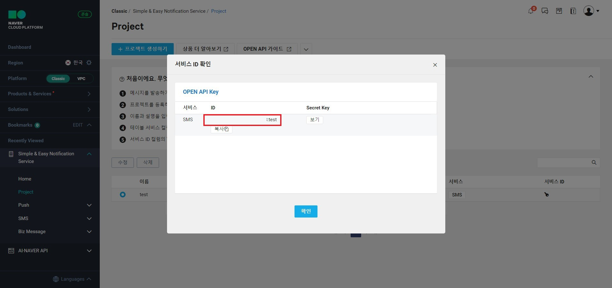
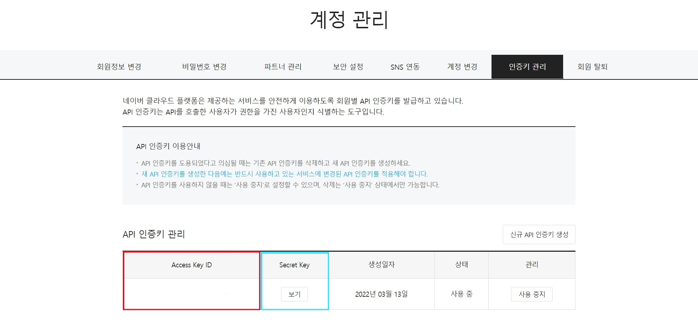

# [Django REST framework] 휴대폰 인증 문자 모델 생성하기

회원가입을 진행할 때 본인인증 방법으로 패스 앱을 이용하거나 전화번호 확인이 있다.

그중에서 전화번호로 인증번호를 확인하여 인증을 하는 방법을 사용해보려고 한다.

전화번호로 인증번호를 보내기 위하여 발신 메시지 서비스가 있어야 한다.

네이버 클라우드에서 제공하는 [Simple & Easy Notification Service](https://www.ncloud.com/product/applicationService/sens)를 이용하였다. 

## 인증번호 저장 모델

1. 유저의 전화번호와 인증번호를 컬럼을 생성한다.

2. `save` 함수를 다시 재정의한다.

   1.  랜덤한 수를 생성하여 `auth_number`에 할당하고 난 후 부모 save를 불러 저장한 다음에 sms을 전송한다.

3. 인증번호 전송 함수는 네이버에서 sms를 보내기 위해 필요한 정보들을 채워서 보낸다. [sms API](https://api.ncloud-docs.com/docs/ai-application-service-sens-smsv2)

   1. [네이버 sms 인증 발신번호 생성하는 방법 보러 가기](https://maximum-curry30.tistory.com/355)

   2. | key 이름                                         | 내용                                 |
      | ------------------------------------------------ | ------------------------------------ |
      | key["SMS_ACCESS_ID"]                             |         |
      | key["ClOUD_ACCESS_KEY"], key["ClOUD_SECRET_KEY"] |         |
      | key["SMS_PHONE_NUMBER"]                          | 휴대폰 인증 메시지를 보내는 발신번호 |

   3. 인증번호 전송을 위한 작업은 다음과 같다.

      1. Signature를 만든다.
      2. 필요한 headers와 body를 채운다.
         1. body에 있는 4개의 값은 모두 필수여서 꼭 채워야 한다.
      3. json으로 body값을 변환하고 post 요청을 하면 된다.
   
   4. 이제 보낸 인증번호와 사용자가 입력한 인증번호가 일치하는지 확인해야 한다.
   
      1. 사용자가 입력한 값을 사용해야 하고 객체에도 접근해야해서 classmethod를 사용한다.
      2. 사용자가 입력한 전화번호와 인증번호, 시간이 5분이내인 조건중 모든 요청이 충족되는 객체를 반환한다.

```python
# 유저의 전화번호와 인증번호를 담을 테이블
class SmsAuth(TimeStampedModel):
    # 1
    phone_number = models.CharField(max_length=11, validators=[RegexValidator(r"^010?[0-9]\d{3}?\d{4}$")],
                                    primary_key=True, verbose_name='휴대폰 번호')
    auth_number = models.IntegerField(verbose_name='인증 번호')

    class Meta:
        db_table = 'sms_auth'
	# 2
    def save(self, *args, **kwargs):
        self.auth_number = randint(1000, 10000)  # 4자리 랜덤 난수 생성
        super().save(*args, **kwargs)
        self.send_sms()  # SMS 전송하기(인증번호 포함)
	
    # 3
    # 인증번호 전송
    def send_sms(self):
        # 3-1
        timestamp = str(int(time.time() * 1000))
        uri = f'/sms/v2/services/{key["SMS_ACCESS_ID"]}/messages'
        post_url = f'https://sens.apigw.ntruss.com{uri}'

        message = "POST" + " " + uri + "\n" + timestamp + "\n" + key["ClOUD_ACCESS_KEY"]
        message = bytes(message, 'UTF-8')

        signature = self.make_signature(message)
		
        # 3-2
        headers = {
            "Content-Type": "application/json; charset=utf-8",
            "x-ncp-apigw-timestamp": timestamp,
            "x-ncp-iam-access-key": key["ClOUD_ACCESS_KEY"],
            "x-ncp-apigw-signature-v2": signature
        }

        body = {
            "type": "SMS",
            "from": key["SMS_PHONE_NUMBER"],
            "content": f"[테스트] 인증번호 [{self.auth_number}]를 입력해주세요.",
            "messages": [
                {
                    "to": self.phone_number,
                }
            ],
        }
		# 3-3
        requests.post(post_url, data=json.dumps(body), headers=headers)

    def make_signature(self, message):
        secret_key = bytes(key["ClOUD_SECRET_KEY"], 'UTF-8')
        return base64.b64encode(hmac.new(secret_key, message, digestmod=hashlib.sha256).digest())
	
    # 4
    @classmethod
    def check_auth_number(cls, phone_number, auth_number):
        '''
            사용자 입력 인증번호 == db에 저장된 인증번호 확인 함수
            외부의 값을 받아서 현재 모델에서 filter로 결과 확인
            해당 값이 있으면 True, 없으면 False 리턴 
        '''
        time_limit = timezone.now() - datetime.timedelta(minutes=5)
        result = cls.objects.filter(phone_number=phone_number, auth_number=auth_number, modified__gte=time_limit)
        if result:
            return True
        return False

    def __str__(self):
        return f'{self.phone_number}'
```

### 참고

https://yuda.dev/284
