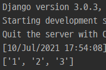
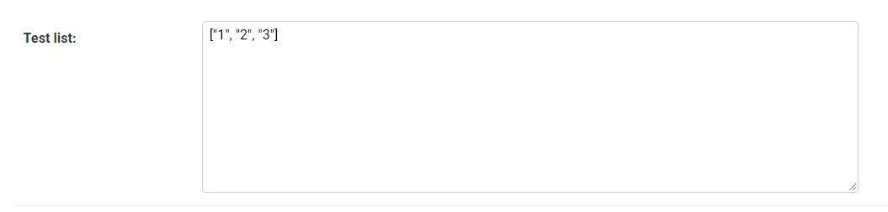

# [django, 장고] 장고 form checkbox 값 여러개 받기

- 장고에서 form으로 체크박스를 받아오면 해당 체크박스 마지막만 받아와졌다. 
- 체크된 값 모두를 받으려면 다음과 같이 views.py를 설정해준다.

```html
<form action="" method="post" enctype="multipart/form-data">
    
    <div>
        <input type="checkbox" name="test_list" value="1">
        <input type="checkbox" name="test_list" value="2">
        <input type="checkbox" name="test_list" value="3">
        <input type="checkbox" name="test_list" value="4">
    </div>
    <button class="btn btn-primary" type="submit">제출</button>
</form>
```

- 우선 name은 기존처럼 model에서 설정한 이름대로 설정해도 무방하다.

```python
def input_test(request):
    if request.POST:
        list_item = request.POST.getlist('test')
        print(list_item)
```

- 여기서 checkbox의 체크된 값을 모두 가져오려면 getlist로 값을 받아오면 된다.


- 위 사진처럼 1,2,3의 값을 체크하고 제출을 클릭하면 리스트로 체크된 value값이 들어온다.



### cbv로 바꿔서 db에 저장하기

- 리스트로 들어오는 것을 확인했으면 db에 저장할 때는 어떻게 할지 생각해보자
- json.dumps로 변환해서 저장하면 리스트로 저장된다.

```python
class TestModel(models.Model):
    test_list = models.TextField(blank=False)
```

```python
class AuthorForm(forms.ModelForm):
    class Meta:
        model = TestModel
        fields = "__all__"
```

```python
class Itemtest(CreateView):
    model = TestModel
    success_url = reverse_lazy('itemtest_index')
    template_name = 'finalApp/itemtest.html'
    form_class = AuthorForm

    def form_valid(self, form):
        test = form.save(commit=False)
        test.test_list = json.dumps(self.request.POST.getlist('test_list'))
        test.save()
        return super().form_valid(form)
```

- 모델을 생성하고 forms도 생성한다.
- views에서 받을 때 바로 저장하지 않고 받았던 값을 json으로 변환해서 저장한다.



- 그러면 다음과 같이 리스트 형태로 저장된다.
- 그러면 이제 읽어올 때는 어떻게 읽어올까?
- json.loads로 하면 리스트로 읽어와진다.

```python
class Itemtest(CreateView):
    model = TestModel
    success_url = reverse_lazy('itemtest_index')
    template_name = 'finalApp/itemtest.html'
    form_class = AuthorForm

    def get(self, request, *args, **kwargs):
        qs = TestModel.objects.all().last()
        result = json.loads(qs.test_list)
		print(result, type(result))
        ctx = {'result' : result}
        return self.render_to_response(ctx)

    def form_valid(self, form):
        test = form.save(commit=False)
        test.test_list = json.dumps(self.request.POST.getlist('test_list'))
        test.save()
        return super().form_valid(form)
```

- get함수를 추가해서 그냥 페이지를 띄울때는 get으로 들어가서 쿼리셋에 있는 방금 저장했던 값을 json으로 불러온다.

```
['1', '2', '3'] <class 'list'>
```

- 잘 읽어오고 형식도 list 그대로다.


- 출력도 잘 된다.

```html
<form action="" method="post" enctype="multipart/form-data">
    
    <div>
        <input type="checkbox" name="test_list" value="1">
        <input type="checkbox" name="test_list" value="2">
        <input type="checkbox" name="test_list" value="3">
        <input type="checkbox" name="test_list" value="4">
    </div>
    <button class="btn btn-primary" type="submit">제출</button>
</form>
<div>json 읽어온 결과
    {{result}}
</div>
```

