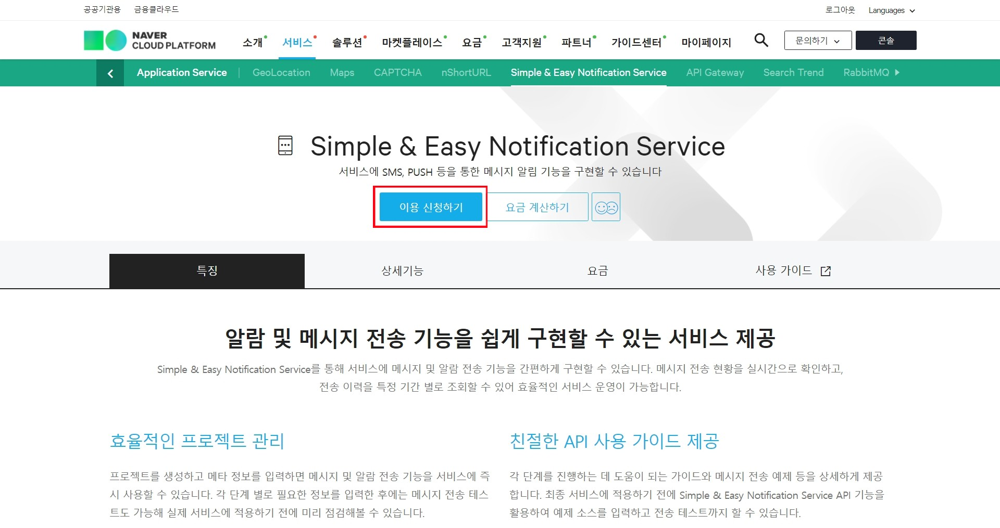
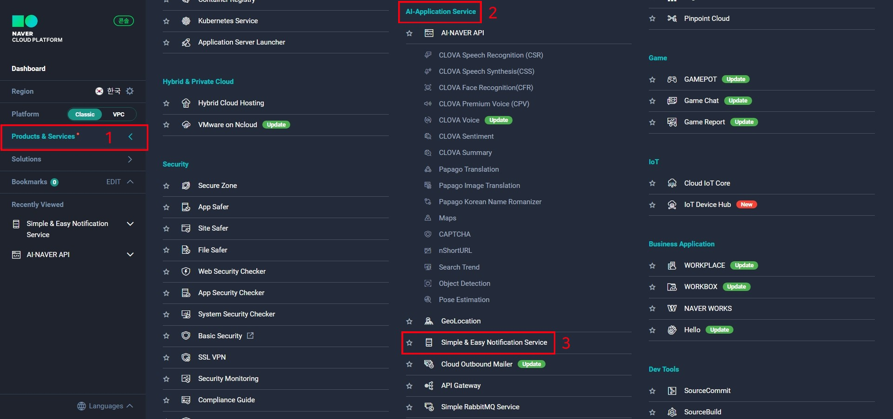
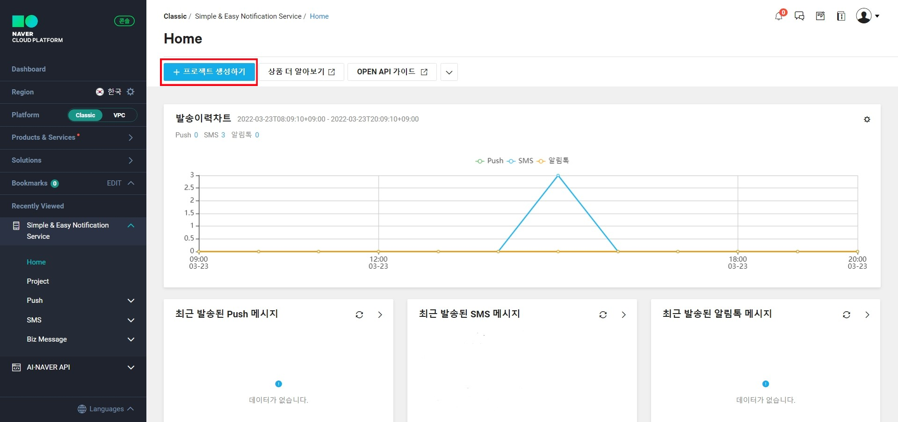
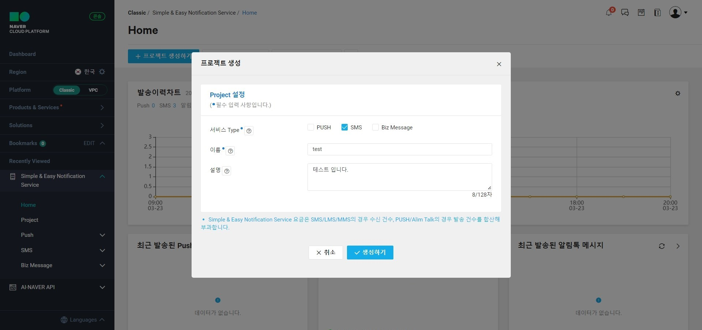
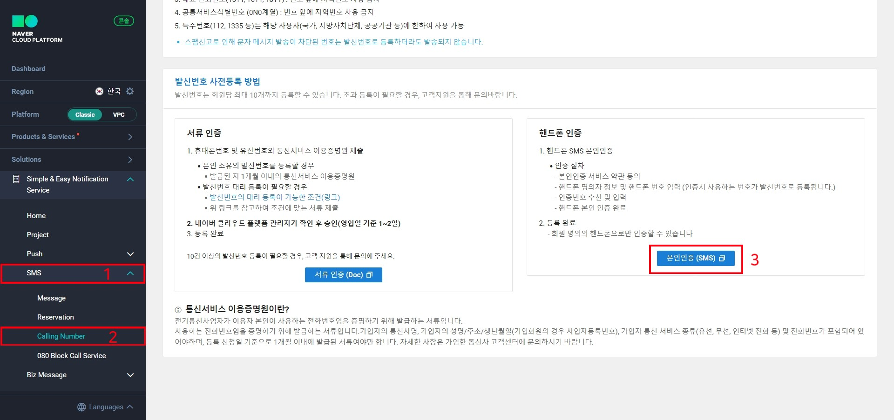
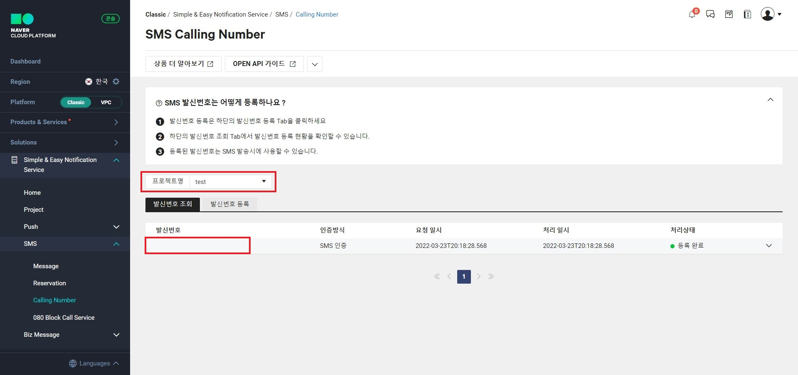
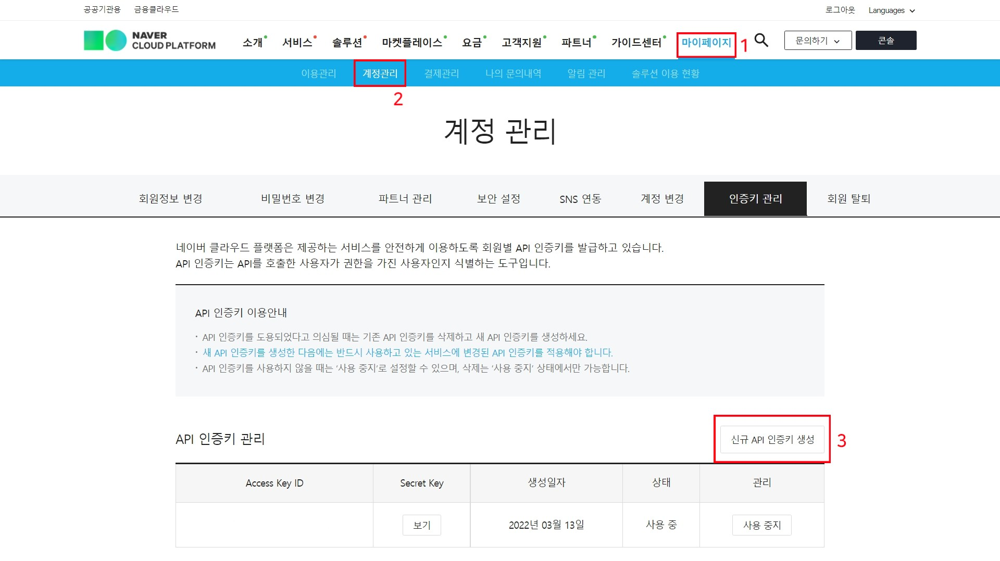

# [네이버 클라우드] Simple & Easy Notification Service 인증키 생성하기

### 1. Simple & Easy Notification Service 이용 신청하기 클릭

[Simple & Easy Notification Service 바로가기](https://www.ncloud.com/product/applicationService/sens)

### 2. 콘솔창에서 Products & Seriveces 클릭 한 후 AI-Application Service에서 Simple & Easy Notification Service 클릭

### 3. 프로젝트 생성하기

### 4. 사용할 서비스의 타입을 선택하고 프로젝트 이름과 설명을 기입

### 5. 생성하기가 완료되면 왼쪽 메뉴에서 SMS를 클릭해 Calling Number로 들어가서 발신번호 등록하기

### 6. 프로젝트명과 등록한 발신번호가 일치하는지 확인하기

### 7. 콘솔말고 네이버 클라우드 페이지에서 마이페이지 > 계정관리 > 인증키 관리에서 신규 API 인증키 생성하기

