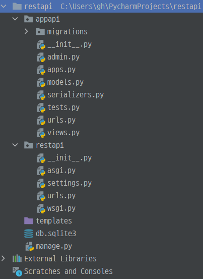

# [Django REST framework] 1. Serialization 시작

### 프로젝트 구조



| 프로젝트 이름 | app 이름 |
| ------------- | -------- |
| restapi       | appapi   |

### 설치하기

- 공식 사이트에 나와있는 설명서를 참고하여 설치

```bash
pip install django
pip install djangorestframework
pip install pygments  # We'll be using this for the code highlighting
```

- pygments는 코드 강조기능 

### App 추가하기

#### restapi > restapi > settings.py

- INSTALLED_APPS에 `rest_framework`, `appapi` 를 추가한다.

```python
INSTALLED_APPS = [
    'django.contrib.admin',
    'django.contrib.auth',
    'django.contrib.contenttypes',
    'django.contrib.sessions',
    'django.contrib.messages',
    'django.contrib.staticfiles',

    # install app
    'rest_framework',
    'appapi',
]
```

### 모델 생성

#### restapi > appapi > models.py

```python
from django.db import models
from pygments.lexers import get_all_lexers
from pygments.styles import get_all_styles

# Create your models here.

LEXERS = [item for item in get_all_lexers() if item[1]]
LANGUAGE_CHOICES = sorted([(item[1][0], item[0]) for item in LEXERS])
STYLE_CHOICES = sorted([(item, item) for item in get_all_styles()])


class BaseModel(models.Model):
    created_at = models.DateTimeField(auto_now_add=True)
    updated_at = models.DateTimeField(auto_now=True)

    class Meta:
        abstract = True


class Snippet(BaseModel):
    title = models.CharField(max_length=100, blank=True, default='')
    code = models.TextField()
    linenos = models.BooleanField(default=False)
    language = models.CharField(choices=LANGUAGE_CHOICES, default='python', max_length=100)
    style = models.CharField(choices=STYLE_CHOICES, default='friendly', max_length=100)

    class Meta:
        ordering = ['created_at']
```

- BaseModel을 하나 만들고 상속하면 모델을 생성할 때마다 생성 시간과 업데이트 시간을 계속 작성할 필요가 없다.

  - | auto_now_add                | auto_now                                                     |
    | --------------------------- | ------------------------------------------------------------ |
    | 시간을 최초 생성시에만 기입 | 시간을 계속 갱신하여 장고 모델이 저장될때마다 현재 날짜로 갱신 |

- 모델에서 blank와 null

  - 모두 필드(열) 에서 동작

  - | blank (유효성과 관련)        | null (DB와 관련)                           |
    | ---------------------------- | ------------------------------------------ |
    | 장고에서 폼 NULL의 허용 여부 | 데이터베이스에서 필드(열) NULL의 허용 여부 |

  - 장고에서는 null 대신 빈 문자열('')로 저장된다.

### 마이그레이션

```python
python manage.py makemigrations snippets
python manage.py migrate snippets
```

### Serializer 생성

#### restapi > appapi > serializers.py

```python
from rest_framework import serializers
from .models import Snippet, LANGUAGE_CHOICES, STYLE_CHOICES


class SnippetSerializer(serializers.Serializer):
    id = serializers.IntegerField(read_only=True)
    title = serializers.CharField(required=False, allow_blank=True, max_length=100)
    code = serializers.CharField(style={'base_template': 'textarea.html'})
    linenos = serializers.BooleanField(required=False)
    language = serializers.ChoiceField(choices=LANGUAGE_CHOICES, default='python')
    style = serializers.ChoiceField(choices=STYLE_CHOICES, default='friendly')

    def create(self, validated_data):
        return Snippet.objects.create(**validated_data)

    def update(self, instance, validated_data):
        instance.title = validated_data.get('title', instance.title)
        instance.code = validated_data.get('code', instance.code)
        instance.linenos = validated_data.get('linenos', instance.linenos)
        instance.language = validated_data.get('language', instance.language)
        instance.style = validated_data.get('style', instance.style)
        instance.save()
        return instance
```

- instance는 update 할 객체가 들어왔다고 보면 된다.

- `**`를 사용하면 dict를 언팩킹 할 수 있다.

  - foo함수에서 x,y를 인자로 받는다고 설정하였으니 해당되는 키값을 찾아서 매칭시켜준다.

  - ```python
    def foo(x, y):
        print(x, y)
    
    def xy():
        foodict = {'x': '엑스', 'y': '와이'}
        foo(**foodict)
    
    xy()
    >
    엑스 와이
    ```

  - 키 값을 c,d로 설정하면 오류가 난다.

  - ```python
    def foo(x, y):
        print(x, y)
    
    def xy():
        foodict = {'c': '엑스', 'd': '와이'}
        foo(**foodict)
    
    xy()
    >
    TypeError: foo() got an unexpected keyword argument 'c'
    ```

### 실행해보기

#### shell에서 확인하기

- shell을 먼저 실행한다.

```bash
python manage.py shell
```

- 아래 내용을 cmd 창에 복사, 붙여넣기 한다.

```bash
from appapi.models import Snippet
from appapi.serializers import SnippetSerializer
from rest_framework.renderers import JSONRenderer
from rest_framework.parsers import JSONParser

snippet = Snippet(code='foo = "bar"\n')
snippet.save()

snippet = Snippet(code='print("hello, world")\n')
snippet.save()
```

- 인스턴스를 확인해본다.

```bash
serializer = SnippetSerializer(snippet)
serializer.data
{'id': 4, 'title': '', 'code': 'print("hello, world")\n', 'linenos': False, 'language': 'python', 'style': 'friendly'}
```

- many=True를 하면 다수의 데이터 셋을 볼 수 있다.

```bash
serializer = SnippetSerializer(Snippet.objects.all(), many=True)
serializer.data
[OrderedDict([('id', 1), ('title', ''), ('code', 'foo = "bar"\n'), ('linenos', False), ('language', 'python'), ('style', 'friendly')]), OrderedDict([('id', 2), ('title', ''), ('code', 'print("hello, world")\n'), ('linenos', False)
, ('language', 'python'), ('style', 'friendly')]), OrderedDict([('id', 3), ('title', ''), ('code', 'foo = "bar"\n'), ('linenos', False), ('language', 'python'), ('style', 'friendly')]), OrderedDict([('id', 4), ('title', ''), ('cod
e', 'print("hello, world")\n'), ('linenos', False), ('language', 'python'), ('style', 'friendly')])]
```

