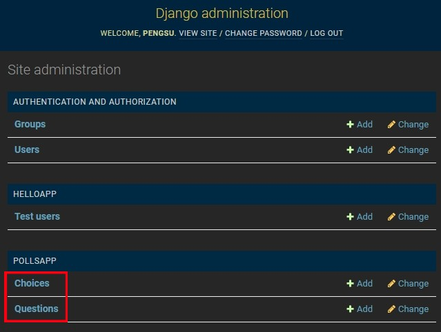
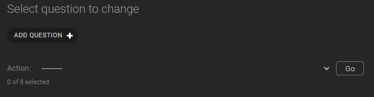
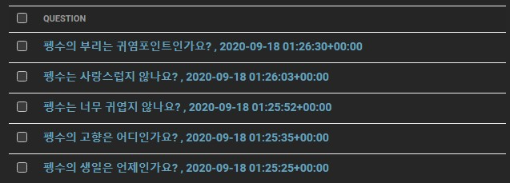
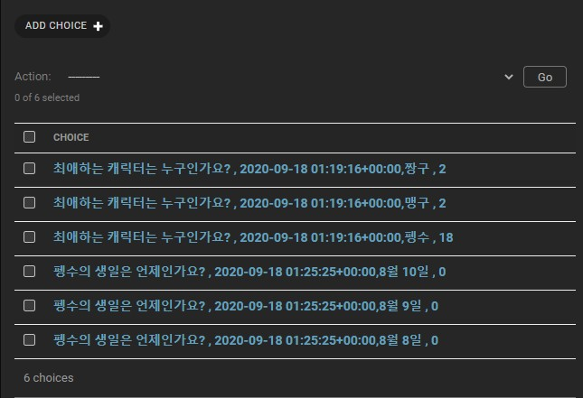
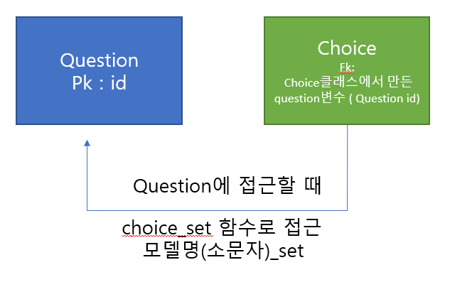
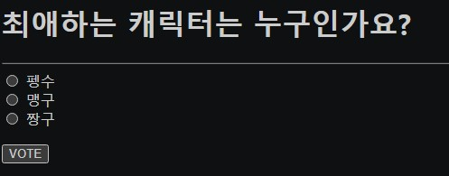
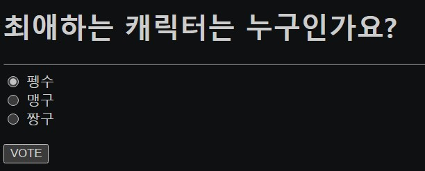
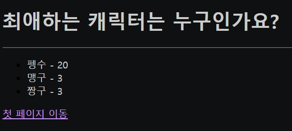
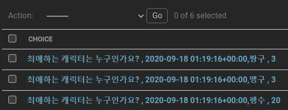

# 장고 - MODEL과 연결

#### 모델과 연결했던걸 다시 복습하기. 

```
(base) C:\Users\gh\PycharmProjects\wenSample2\django>python manage.py startapp PollsApp
```

- `python manage.py startapp PollsApp` 으로 `PollsApp` 를 만들어 준다.

- `App` 을 추가했으니 `django` - `settings.py` 에로 가서 `PollsApp` 을 추가시켜준다.

  - ```python
    INSTALLED_APPS = [
        'django.contrib.admin',
        'django.contrib.auth',
        'django.contrib.contenttypes',
        'django.contrib.sessions',
        'django.contrib.messages',
        'django.contrib.staticfiles',
        'PollsApp'
    ]
    ```

    

- `PollsApp` - `models.py` 로 가서 `class` 를 만들어준다. 

- ```python
  class Question(models.Model):
      question_text = models.CharField(max_length=200)
      regdate       = models.DateTimeField('date published')
  
      def __str__(self):
          return self.question_text + " , " + str(self.regdate)
  ```

  - `def __str__(self)` 이건 내장 함수의` str` 을 `return` 값으로 나타내 주라는 말이다. `regdata` 는 숫자라서 **str** 로 변환해주었다.
  - `id` 는 별도로 설정하지 않으면 자동으로 생성되고**`primary key`** 로 설정된다.
    - id = intger형식이다.
  - 총 3개의 컬럼이 생성된다고 보면 된다.

- ```python
  class Choice(models.Model):
      question    = models.ForeignKey(Question, on_delete=models.CASCADE)
      choice_text = models.CharField(max_length=200)
      votes       = models.IntegerField(default=0)
  
      def __str__(self):
          return str(self.question) + "," + self.choice_text + " , " + str(self.votes)
  ```

  - `question` 은 `Question` 의 `id` 를 외래키로  설정하는 것이다. 

  - `on_delete=models.CASCADE` 

    - `on_delete` : Django에서 모델을 구현할 때 데이터베이스 상에서 참조무결성

      을 유지하여 ForeignKeyField가 바라보는 값이 삭제될 때 해당 요소를 처리하는 방법을 지정

    - `on_delete=models.CASCADE` : ForeignKeyField를 포함하는 모델 인스턴스(row)도 같이 삭제한다.

- 테이블을 관리하려면 admin을 주어야 한다. `PollsApp` - `admin.py` 로 이동한다.

  - ```python
    from .models import *
    
    admin.site.register(Question)
    admin.site.register(Choice)
    ```

  - 다음과 같이 `models.py` 에서 만든 `class` 를 부여해준다.

- **모델 마이크레이션** 을 해준다.

  - ```
    (base) C:\Users\gh\PycharmProjects\wenSample2\django>python manage.py makemigrations
    Migrations for 'PollsApp':
      PollsApp\migrations\0001_initial.py
        - Create model Question : 테이블이 만들어졌다.
        - Create model Choice : 테이블이 만들어졌다.
    ```

  - ```
    (base) C:\Users\gh\PycharmProjects\wenSample2\djanWEB>python manage.py migrate
    Operations to perform:
      Apply all migrations: PollsApp, admin, auth, contenttypes, helloApp, sessions
    Running migrations:
    Applying PollsApp.0001_initial... OK : 반영이 되었다
    ```

  - 이제 관리자 계정으로 접근해서 DB를 관리할 수 있다.

  - 만약에 `models.py` 의 값을 변경하였다면 다시 

    - `python manage.py makemigrations` 
    - `python manage.py migrate` 을 해주어야 한다.

#### Django administration에 접근해서 만들기

- `http://localhost:8000/admin/` 에 접속하면 `class` 함수가 추가된 걸 볼 수 있다.



- `Question` 을 클릭해서 



- **ADD QUESTION** 을 클릭해서 질문을 추가시킨다.



- 다음과 같은 목록을 확인한다.

- 이번에는 `Chocie` 를 클릭해서 



- 다음과 같은 목록을 만든다.
- 이건 관리자가 만든거고 이제는 사용자 입장에서 브라우저를 보여줄 것이다.  그걸 설정하러 가보자.

#### 브라우저 설정하러 가자.

- `http://localhost:8000/polls/index/` 에 내가 만든 `Question` 목록이 보이게 설정할 것이다.

- 그럼 `django` - `urls.py` 에서 `polls` 가 `index` 를 포함하게 만들어 주어야 한다. 

  - ```python
    urlpatterns = [
        path('admin/', admin.site.urls),
        path('polls/', include('PollsApp.urls')),
    ]
    ```

  - ` path` 에 `polls/` 를 추가시켜   `PollsApp` 의 최조 접근을  `PollsApp.urls` - `index` 로 하고 싶다.

- 그러면  `PollsApp.urls`  을 설정해주어야 한다. 

  - ```python
    from django.urls import path, include
    from PollsApp import views
    
    urlpatterns = [
        path('index/', views.index, name='index'),
    ]
    ```

  - `path` 를 설정한다.

- 그러면 `views` 로 가서  `index`  함수를 설정해줘야 한다.

  - ```python
    from django.http import HttpResponse, HttpResponseRedirect
    from django.urls import reverse
    from django.shortcuts import render, get_object_or_404, redirect
    from .models import *
    
    def index(request):
    	lists = Question.objects.all()
        context = {'lists' : lists}
        return render(request, 'polls/index.html', context)
    ```

  - 현재 `Question` 에는 내가 입력한 질문의 내용과 시간이 저장되어 있다. 그것을 `lists` 에 모두 가져온다. 

    - 리스트 형식으로 [{}, {}] 담긴다.

  - `context` 에 딕셔너리 형식으로 다시 담는다. 

- 이제는 `polls/index.html` 에 `context`를  표시해줄거라 `PollsApp` 에 `templates` 폴더를 만들고  그 밑에 `polls` 폴더를 만든다. 그 안에 `index.html` 파일을 만든다.

  - ```html
    <body>
        
        <ul>
            
            <li><a href="../{{ question.id }}">{{ question.question_text }}</a></li>
            
        </ul>
        
            <p>데이터가 존재 하지 않습니다</p>
        
    </body>
    ```

  - `lists` 의 값이 있으면 for 루프를 돈다. 

  - 그 값을 `question` 에 담았다.

  -  `question.question_text`  을 통해 질문을 웹페이지에 나타낸다. 

  - 해당 질문에 선택할 수 있도록 링크를 건다. 

  - `"../{{ question.id }}" `: `polls/index/id`가 아니라 `polls/id`가 되어야 하기 때문에 `polls/ `로  나와서 링크로 가게 한다.

#### 선택 웹페이지 구성

- 선택할 수 있는 페이지 url이 필요하기 때문에 `PollsApp` - `urls.py` 로 간다.

  - ```python
    urlpatterns = [
        path('index/', views.index, name='index'),
        path('<int:question_id>/', views.choice, name='choice'),
    ]
    ```

  - `path` 를 추가한다. `Question` 의 `id` 값이 넘어올텐데 그걸 `question_id` 로 지정하고 `view.choice` 로 이동한다.

- `views.py` 에 `choice` 함수를 만든다.

  - ```python
    def choice(request, question_id):
        lists = get_object_or_404(Question, pk=question_id)
        context = {'clist' : lists}
        return render(request, 'polls/choice.html', context)
    ```

  - 위에서 `question_id` 를 받도록 설정했기 때문에 `question_id` 값을 인자로 받아야 한다. 

  - `get_object_or_404` 는 `Question` 모델 클래스로부터  검색조건 `pk=question_id`  따라 객체를 조회한다. 조건에 맞는 객체가 없으면 404를 띄우고 아니면 객체를 가져온다. 

  - 그걸 `context`에 딕셔너리로 담는다. 

  - `polls/choice.html` 를 찾기 때문에 `choice.html` 을 만들러가자.

- `polls` 에 `choice.html` 을 만든다.

  - ```html
    <body>
        <h1>{{ clist.question_text }}</h1>
        <hr/>
        <form method="post" action="">
        <input type="hidden" name="question_id" value="{{clist.id}}"/>
        
        
        <input type="radio"
               name="choice"
               value="{{choice.id}}">
        <label>{{ choice.choice_text }}</label><br/>
        
        <p/>
        <input type="submit" value="VOTE">
        </form>
    </body>
    ```

  - `<h1>{{ clist.question_text }}</h1>` 

    - `clsit` 에 `lists` 를 담아서 거기에 있는 질문을 가져온다.

  - `<form></form>` 으로 감싸줘야지 투표했을 때 투표수를 반영할 수 있다.

  - `<input type="hidden" name="question_id" value="{{clist.id}}"/>`

    - `VOTE` 의 값을 누적하고 싶은데 어떤 `question` 인지 모르니 `question` 의 `id` 을 같이 넘겨주는 것이다. 

  - `for choice in clist.choice_set.all` 

    - `choice_set` 이 객체에 접근할 수 있는 함수이다.  

      

    - `clist` 에는 `Question` 의 값이 담겨져있다. `Question` 을 외래키로 참조하는 모든 `Choice` 의 모델을 가져오는 것이다. 가져온 모델을 choice에 담는다. 

  - `<input type="radio" name="choice" value="{{choice.id}}">` 

    - `choice.id` 마다 라디오 버튼을 생성해준다. 

  - `<label>{{ choice.choice_text }}</label><br/>` 

    - 라디오 버튼 옆에 choice_text를 표시해준다. 

  - `<input type="submit" value="VOTE">` 
  
    - 이제 `VOTE` 를 누르면 `action=""` 이 실행되어야 한다. 

**지금까지 만든걸 웹페이지에서 보면 다음과 같다**




- 캐릭터를 선택하고 `VOTE` 를 누르면 투표수가 증가하도록 작성하자.

#### `vote` 가 실행되게 하자.

- `urls.py` 에 다음과 같이 추가한다. 

  - ```python
    urlpatterns = [
        path('index/', views.index, name='index'),
        path('<int:question_id>/', views.choice, name='choice'),
        path('vote/', views.vote, name='vote'),
    ]
    ```

- `views.py` 로 가서 `vote` 함수를 만든다.

  - ```python
    def vote(request):
        choice = request.POST['choice']
        question_id = request.POST['question_id']
        
        question = get_object_or_404(Question, pk=question_id)
        checked_choice = question.choice_set.get(pk=choice)
        checked_choice.votes += 1
        checked_choice.save()
    
        request.session['question_id'] = question_id
        return redirect('result')
    ```

  - `POST` 방식으로 받아왔기 때문에 `POST` 로 `choice` 랑 `question_id` 를 변수에 할당한다.

  - `question` 에는 `Question` 에서 키가 `question_id` 인 모델들만 할당한다. 

  - `question` 과 외래키로 연결되어 있는 `choice` 의 모든 값을 가져온다. 

    - `pk` 가 `choice` 인것들, 
      - 위 `html` 에서 `<input type="radio" name="choice" value="{{choice.id}}">` 이 값을 비교해 주는 것이다. 
    
  - `checked_choice` 에는 `Choice` 에서 만들었던 `votes` 가 있을 것이다. 이 값을 누적해준다.
  
  - 그리고 다시 저장해준다.
  
  - ` request.session['question_id'] = question_id` 
  
    - django에서는  `request.session`  이라는 딕셔너리로 객체에 필요한 값을 저장하고 읽어올 수 있다.
    - `question_id` 에 `Question` 의`id` 를 저장한다.
    - 그럼 어떤 `question` 의 `vote` 가 업데이트 되었는지 알 수 있다.
  
  - `redirect('result')` 를 하는 이유는 업데이트된 결과를  보여주기 위해서 `return` 한다.
  
    - `polls/result.html` 로 가달라는 말이다. 
    - `result` 는 `urls.py` 에 있는 `path`  의 `id` 값이다. 그러면 `urls.py` 에 값을 추가해주자.
  
- `urls.py`  에 다음과 같이 `path` 를 추가한다.

  - ```python
    urlpatterns = [
        path('index/', views.index, name='index'),
        path('<int:question_id>/', views.choice, name='choice'),
        path('vote/', views.vote, name='vote'),
        path('result/', views.result, name='result'),
    ]
    ```

- `views.py` 로 가서 `result` 함수를 만들자.

- ```python
  def result(request):
      question_id = request.session['question_id']
      question = get_object_or_404(Question, pk=question_id)
      context = {'question' : question}
      return render(request, 'polls/result.html', context)
  ```

  - `question_id` 는 위에서 `vote()` 에서 저장해 주었던 값을 다시 꺼내온다.
  - `Question`  에서 그 값에 해당하는 컬럼들을 저장해준다. 
  - 이 값을 다시 `context` 에 딕셔너리 형식으로 저장한다.
  - 이제 `result.html` 를 이용하여 웹페이지에 표시해주러 가자.

- `templates` - `polls` 에 `result.html` 파일을 만든다.

  - ```html
    <body>
        <h1>{{ question.question_text }}</h1>
        <hr/>
        <ul>
            
            <li>{{ choice.choice_text}} - {{choice.votes}}</li>
            
        </ul>
        <p/>
        <a href="">첫 페이지 이동</a>
    </body>
    ```

  - `{{ question.question_text }}` 

    - 질문을 표시해주는 것이다.

  - `` 

    - `question` 을 외래키로 하는 `choice` 의 모든 값을 가져와서 `choice` 로 이름을 지어준다.

  - `<li>{{ choice.choice_text}} - {{choice.votes}}</li>` 

    - 그럼 `Choice` 에 있던 컬럼 `choice_text` 와 업데이트 된  `votes` 를 웹페이지에 표시해준다.

  - `<a href="">첫 페이지 이동</a>` 

    - 링크 태그로 다시 맨 처음 페이지로 이동한다.



- 여기서 `VOTE` 를 누르면 투표수가 누적되고, 누적된 값이 반영된 페이지를 보여주게 한것이다.



- 이렇게 누적 투표수를 보여준다. 

#### 그럼 잘 누적되었는지 admin으로 가서 본다.



- 정상적으로 잘 반영되고 있다. 여기에 저장되는 값을 아까 `VOTE` 버튼을 누르면 뷰를 거쳐서 DB에 들렸다가 다시 나오는 것이다. 그걸 웹페이지에 뿌려준다. 