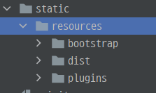

# 장고_CSS로 꾸미기

##  사용할 App폴더를 다시 만들어보자

`python manage.py startapp BbsApp` 으로 `BbsApp`  폴더를 만들었다.

- djanWEB에서 App들을 관리중이라 djanWEB에 url을 추가시켜 줘야 한다.
- `djanWEB` - `urls.py` 에 `path` 를 추가한다.

```python
urlpatterns = [
    path('admin/', admin.site.urls),
    path('bbs/',   include('BbsApp.urls')),
]
```

- `BbsApp.urls` 로 `urls.py` 를 타러 가자.
- `BbsApp` 에는 `urls.py` 가 없으니 `urls.py` 파일 하나를 만든다.
-  `urls.py` 에 `path`를 추가시킨다.

```python
urlpatterns = [
    path('index/', views.loginForm, name='loginForm'),
]
```

- 사용자가 `index/` 에 도달하면 `views.py` 에 있는 `loginForm` 이 실행되게 하자.
- `BbsApp` - `views.py` 에 `loginFrom` 함수를 만든다.

```python
def loginForm(request):
    return render(request, 'login.html')
```

- `render` 함수는 **forword** 형식으로 `templates` 를 찾는 것이다. 사용자에게 웹페이지를 보여주는 것이다.
- `login.html` 로 가자. **bootstrap** 으로 구성된 웹페이지 화면을 활용하였다.

#### bootstrap으로 웹페이지 꾸미기

- 우선 `djanWEB` - `setting.py` 에서 **bootstrap** 형식들이 관리되어야 한다.

```python
STATIC_URL = '/static/'
STATICFILES_DIRS = [
    os.path.join(BASE_DIR, 'BbsApp', 'static')
]

STATIC_ROOT = os.path.join(BASE_DIR, 'static')
```

- `BbsApp` 에 `static` 폴더를 추가한 후, `djanWEB` - `setting` 에 다음과 같이 추가해준다.



- 그 다음 가지고 있는 소스들을 `static` 폴더 밑에 복사한다.
- 앞서 말했듯이 `djanWEB` 이 `App` 의 `static` 폴더들을 관리한다. `static` 의 전체적인 관리를 `djanWEB` 에서 하여야 기본적으로 `App` 폴더에서 사용할 수 있다. 
  - 왜냐하면 `BbsApp` 폴더 말고도 `BApp` 와 `CApp` 에도 `static` 가 있을 수 있으니 하나로 모아야 한다.
- 콘솔창에 **`python manage.py collectstatic`** 을 입력하면 `djanWEB` 에 `static` 폴더가 생긴다.


- css설정을 완료했으니 이제 `templates` 을 찾으러 가자.

- `BbsApp` 에 `templates`  폴더를 만들고 **bootstrap** 로 틀이 만들어진 `login.html` 파일을 복사한다. 
- `login.html` 에서 `static` 를 쓰고 싶으면 `html` 파일 맨 처음에 **** 을 추가시켜서 `static` 를 불러온다.


- 로그인을 하려면 우선 계정을 만들어야 한다. **Register a new membership** 를 누르면 계정 생성 창으로 이동하도록 하자.
- `login.html` 로 이동한다. 

```python
<a href="" class="text-center">Register a new membership</a>
```

- `url registerForm`  로 이동하도록 링크를 건다. 
  - 그럼 `urls.py` 에 `registerForm` 가 있어야 아니 `path` 를 추가해주자.

```python
urlpatterns = [
    path('index/', views.loginForm, name='loginForm'),
    path('registerForm/', views.registerForm, name='registerForm'),
]
```

- `views.py` 에 `registerForm` 함수를 찾으러 가자.

```python
def registerForm(request):
    return render(request, 'join.html')
```

- 가입할 수 있는 웹페이지가 나오도록 `join.html` 로 이동하자.

기존에 있던 `join.html` 을 `templates` 폴더에 복사한다.

```html
 
```

- 맨 위에 똑같이 `static` 를 불러오게 추가한다.

그럼 가입 할 때  `user_id` 와 `user_pwd` , `user_name` 를 입력하여 가입할 수 있도록 `models.py` 에 `class` 를 만들자.

```python
class BbsUserRegister(models.Model):
    user_id = models.CharField(max_length=50)
    user_pwd = models.CharField(max_length=50)
    user_name = models.CharField(max_length=50)
```

- model 은 orm을 통해서 dm랑 통신한다. model에 class를 만들고, db에 테이블로 전환하는 작업이다.
  - 기본키 id를 포함하여 4개의 컬럼이 생성된다.
- 테이블을 우리가 관리할 것이니 `BbsApp` - `admin.py` 에 `BbsUserRegister` 함수가 관리자 권한을 가지도록 등록한다.

```python
admin.site.register(BbsUserRegister)
```

- 이제 연결해주는 마이그레이션이 필요하다.
- 콘솔창에 다음과 같이 입력한다.

```
python manage.py makemigrations
```

```
- Create model BbsUserRegister 
```

- 모델이 만들어진다.

```
python manahe.py migrate
```

- 서버를 가동시킨다.

```
python manage.py runserver
```


- 정상적으로 가입화면이 나온다. 이제 **Register** 를 클릭하면 저장되고 로그인을 할 수 있게 만들러가자.

#### 로그인하기

- `join.html` 로 가서 

```html
<form action="" method="post">
```

- **Register** 를 클릭하면 `url register` 로 가서 실행할 수 있도록 링크를 건다.
- `urls.py` 에 다음과 같이 `path` 를 추가한다.

```python
urlpatterns = [
    path('index/', views.loginForm, name='loginForm'),
    path('registerForm/', views.registerForm, name='registerForm'),
    path('register/', views.register, name='register'),
]
```

- `views.py` 에 `register` 함수를 실행시키러 가자.

```python
def register(request):
    if request.method == 'POST':
        id   = request.POST['id']
        pwd  = request.POST['pwd']
        name = request.POST['name']

        register = BbsUserRegister(user_id=id, user_pwd=pwd, user_name=name)
        register.save()
    return redirect('loginForm')
```

- 우리가 받아오는 방식이 `POST` 방식이니 `POST` 로 키인한 `id` , `pwd` , `name`  를 받아온다. 그 다음에 db로 테이블을 관리할 것이니  `BbsUserRegister` 함수를 실행시킨다.
- 값이 변경되면 `save()` 로 다시 저장해준다.
- 등록이 완료되었으니 로그인화면으로 돌아가 로그인 할 수 있게 `redirect` 로 맨 처음 로그인 화면으로 가게한다.


- 이제 `Sign in` 을 클릭하면 웹사이트로 들어가는 화면을 구성하러 가자.
- `login.html` 로 가서 

```html
<form action="" method="post">
```

- `url login` 으로 이동하게 링크를 걸어준다. 
- `urls.py` 에 `path` 를 추가한다.

```python
urlpatterns = [
    path('index/', views.loginForm, name='loginForm'),
    path('registerForm/', views.registerForm, name='registerForm'),
    path('register/', views.register, name='register'),
    path('login/', views.login, name='login'),
]
```

- `views.py` 에 `login` 함수를 만들러가자.

```python
def login(request):
    if request.method == 'GET':
        return redirect('login')
    elif request.method == 'POST':
        id  = request.POST['id']
        pwd = request.POST['pwd']
        user = BbsUserRegister.objects.get(user_id=id, user_pwd=pwd)
        print('user result : ', user)
        context = {}
        if user is not None:
            request.session['user_name'] = user.user_name
            context['userSession'] = request.session['user_name']

    return render(request, 'home.html', context)
```

- 우리가 받아오는 형식이 `POST` 방식이라 `GET` 방식이면 로그인 화면을 다시 불러온다.
- `POST` 방식이면 `POST` 형식으로 받아서 `id` 와 `pwd` 를 변수에 저장한다. 
- `BbsUserRegister.objects.get(user_id=id, user_pwd=pwd)`
  - `BbsUserRegister` 함수에 `(user_id=id, user_pwd=pwd)` 두 가지 조건을 걸어 해당하는 객체들을 모두 가져온다. 


- 이렇게 로그인한 정보가 저장되서 로그아웃 전까지 화면에 나타나도록 `session` 에 저장한다.
- 그 값을 `context` 에 담아서 딕셔너리 형태로 관리한다. 
- 그럼 이제 홈화면을 보여주기 위하여 `home.html` 로 가자.

```html
<section class="content">
```

- `home.html` 은  `<section>` 으로 시작한다. 
  - `<header>` 와 `<footer>` 는 어디어 있을까??
- `<header>` 와 `<footer>` 는 데이터가 같고 `<body>` 만 값이 바뀐다.
  - 위에서 `djanWEB` 에서 `App` 들을 관리한다고 하였으니 `djanWEB` 에 `templates` 폴더를 만든다.
  - 그 안에 `footer.html` 과 `header.html` 을 붙여넣기한다.

-  각각의 `App templates` 에서 사용하기 위해서 `djanWEB` - `setting` 에서 

```python
TEMPLATES = [
    {
        'BACKEND': 'django.template.backends.django.DjangoTemplates',
        'DIRS': [os.path.join(BASE_DIR, 'djanWEB/templates')],
```

- `os.path.join(BASE_DIR, 'djanWEB/templates')` 이 값을 추가시켜준다.

- `home.html` 에 `header.html` 과 `footer.html` 을 사용한다는 명령어들을 추가한다.

```html


-----------<body>---------


```


- 홈화면이 다음과 같이 나온다. 

#### redirect와 render 차이점

