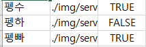
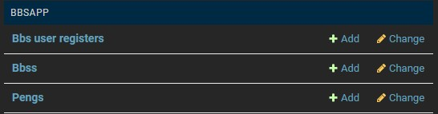
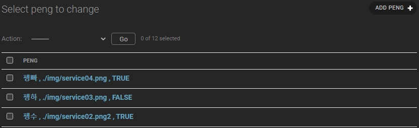
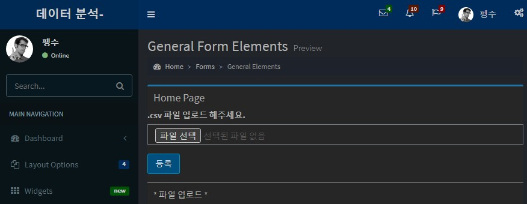
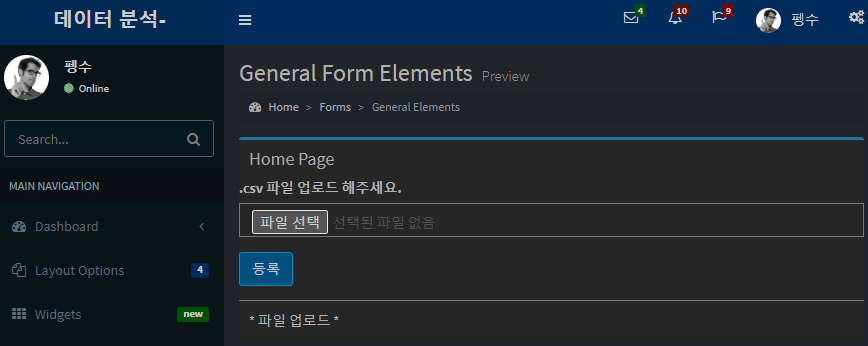
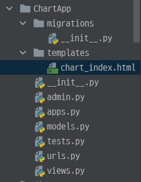
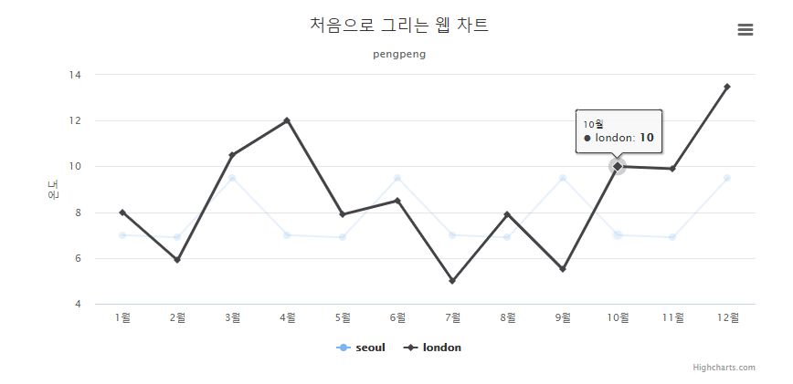
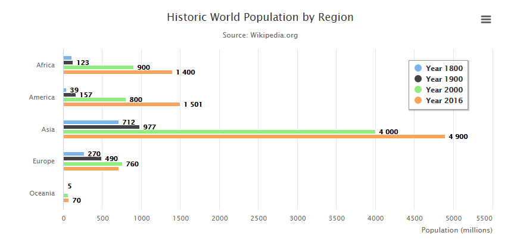
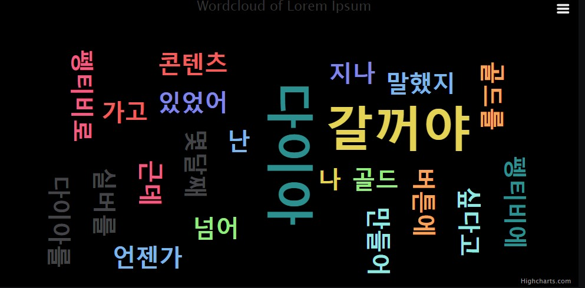
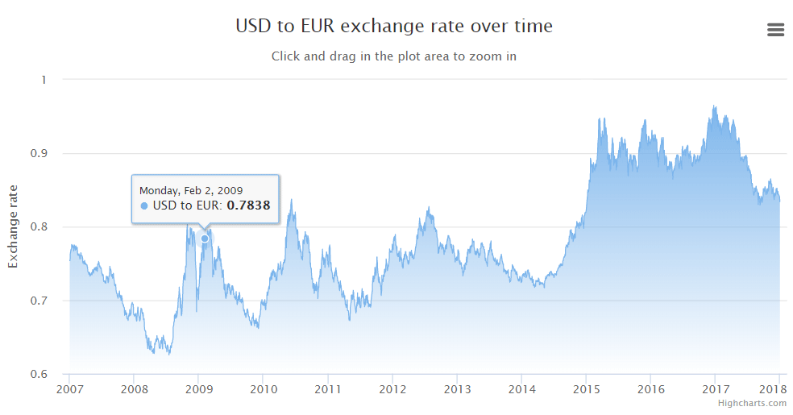

# 장고_csv,chart

### csv파일 불러오기

-  csv파일을 불러와서 `model` 에서 만든 컬럼들에 적용시켜서 DB로 보낸다.
- 우선 `BbsApp` - `models.py` 에 우리가 만들 테이블 `class` 를 만든다. 

```python
class peng(models.Model):
    name = models.CharField(max_length=50)
    img  = models.CharField(max_length=50)
    status = models.CharField(max_length=50)

    def __str__(self):
        return self.name + " , " + self.img + " , " + self.status
```



- 우리가 만든 csv 파일에 이름, 이미지, status가 있어서 3개의 컬럼을 만들도록 `class` 를 구성하였다. 
- 사용자의 request를 받아야 하니깐 url을 추가한다.

```python
urlpatterns = [
    path('index/', views.loginForm, name='loginForm'),
    path('registerForm/', views.registerForm, name='registerForm'),
    path('register/', views.register, name='register'),
    path('login/', views.login, name='login'),
    path('logout/', views.logout, name='logout'),
    path('bbs_list/', views.list, name='bbs_list'),
    path('bbs_registerForm/', views.bbsRegisterForm, name='bbs_registerForm'),
    path('bbs_register/', views.bbsRegister, name='bbs_register'),
    path('bbs_read/<int:id>', views.bbsRead, name='bbs_read'),
    path('bbs_remove/', views.bbsRemove, name='bbs_remove'),
    path('bbs_modifyForm/', views.bbsModifyForm, name='bbs_modifyForm'),
    path('bbs_modify/', views.bbsModify, name='bbs_modify'),
    path('bbs_search/', views.bbsSearch, name='bbs_search'),
    path('csvToModel/', views.csvToModel, name='csvToModel'),]
```

- `views.py` 에 `csvToModel` 함수를 만든다.

```python
def csvToModel(request):
    path = 'c:/csv/peng.csv'
    file = open(path)
    reader = csv.reader(file)
    list = []
    for row in reader :
        list.append(peng(name=row[0],
                          img=row[1],
                          status=row[2]))
    peng.objects.bulk_create(list)
    peng.objects.values()
    return HttpResponse('create model ~~')
```

- 우선 경로를 우리가 파일을 저장해 놓은 곳으로 지정한다.
- 그다음 파일을 열고 읽어온다.
- `for` 구문을 이용하여 한줄씩 읽어온다.
  - `row` 하나가 한 줄씩이다.
  - row[0] : 펭수, row[1] : ./img, row[2] : TRUE
  - 이걸 리스트에 추가한다.
  - 값을 `insert` 하는것이라 `save` 쓸 줄 알았는데 `save` 가 아니라 `bulk_create(list)` 로 저장해야한다. 

- `peng.objects.values()` 을 하는 이유는 오류가 없는지 확인하기 위해서이다. 
- 관리자 계정에서 값이 정상적으로 들어갔는지 확인하기 위하여 `BbsApp` - `admin.py` 에 `peng` 를 추가시킨다.

```python
admin.site.register(peng)
```

- 그 다음에는 모델에 값이 추가되었으니 마이크레이션을 실행한다.
- 마지막으로 서버를 가동한다.

`localhost:8000/admin` 으로 들어가서 확인한다.





- 값이 정상적으로 들어간것을 알 수 있다.

#### 홈 화면에서 파일업로드 하기

- 홈화면은 `home.html` 이다.  코드를 수정해주자.

```python
<div class="body-body">
   <form method="POST" action="" enctype="multipart/form-data">
      
      <div class="form-group">
         <label>.csv 파일 업로드 해주세요.</label>
         <input type="file" class="form-control" name="csv_file">
      </div>
      <button type="submit" class="btn btn-info">
         등록
      </button>
   </form>

</div>
<div class="box-footer">
   * 파일 업로드 *
</div>
```

- 파일 업로드 방식은 `POST` 방식만 지원해서 `POST` 형식으로 설정한다. 
- 등록버튼을 클릭하면 `attachCsv` 로 갈 수 있도록 설정한다. 
- `enctype="multipart/form-data"` 은 파일업로드 할 때 약속이다.
- `class="form-group"` 부트스트랩에서 지정된 양식을 불러오려고 설정해준다. 
- `type="file"` 는 파일을 선택할 수 있게 해주는 타입이다.
- `attachCsv` url과 `name="csv_file"` 을 받아오는 작업이 추가적으로 필요하다.



- 홈 화면에 이렇게 뜬다.
- 파일선택을 하고 등록을 누르면 파일이 서버에 저장되도록 하자.

```python
urlpatterns = [
    path('index/', views.loginForm, name='loginForm'),
    path('registerForm/', views.registerForm, name='registerForm'),
    path('register/', views.register, name='register'),
    path('login/', views.login, name='login'),
    path('logout/', views.logout, name='logout'),
    path('bbs_list/', views.list, name='bbs_list'),
    path('bbs_registerForm/', views.bbsRegisterForm, name='bbs_registerForm'),
    path('bbs_register/', views.bbsRegister, name='bbs_register'),
    path('bbs_read/<int:id>', views.bbsRead, name='bbs_read'),
    path('bbs_remove/', views.bbsRemove, name='bbs_remove'),
    path('bbs_modifyForm/', views.bbsModifyForm, name='bbs_modifyForm'),
    path('bbs_modify/', views.bbsModify, name='bbs_modify'),
    path('bbs_search/', views.bbsSearch, name='bbs_search'),
    path('csvToModel/', views.csvToModel, name='csvToModel'),
    path('attachCsv/', views.csvUpload, name='attachCsv'),
]
```

- `views.py` 에 `csvUpload` 함수를 만들자.

```python
def csvUpload(request):
    file = request.FILES['csv_file']
    if not file.name.endswith('.csv'):
        return redirect('loginForm')
    result_file = file.read().decode('UTF-8').splitlines()
    reader = csv.reader(result_file)
    list=[]
    for row in reader:
        list.append(peng(name=row[0],
                          img=row[1],
                          status=row[2]))
    file.close()
    peng.objects.bulk_create(list)
    peng.objects.values()
    return redirect('loginForm')
```

- 파일을 받아올 때 `request.FILES` 로 받아와야 한다.
- 만약에 `.csv` 파일이 아니면 다시 지금의 홈화면이 나오도록 한다. 
- 파일을 줄단위로 읽어온다. 
  - 이렇게 읽으면

```
['펭수,./img/service01.png,TRUE', '펭하,./img/service02.png,FALSE', '펭빠,./img/service02.png,TRUE']
```

- 줄마다의 리스트가 아니라 하나의 리스트로 되어버린다. 
- 그러니 하나의 행이 하나의 리스트로 되도록 다시 루프를 돌리고 DB에 저장되도록 한다.

```
-------------- ['펭수,./img/service01.png,TRUE']
-------------- ['펭하,./img/service02.png,FALSE']
-------------- ['펭빠,./img/service02.png,TRUE']
```

- 이렇게 값이 행마다 리스트로 된다.
- 파일을 열었으니 닫아준다.
- 그다음에 다시 객체들을 지정해줬으니 벌크만들어서 끝낸다.
- 업로드가 완료되면 다시 지금 홈화면으로 나오도록 한다.



- DB에도 값이 정상적으로 추가되었다. 

### 시각화_LineChart

- 시각화를 하기 위해 `App` 하나를 만들자.

```
(base) C:\Users\gh\PycharmProjects\wenSample2\djanWEB>python manage.py startapp ChartApp
```

- 콘솔에 명령어를 입력하여 `App` 을 하나 만든다.

- `djanWEB` - `djanWEB` - `seetings` 가서 `ChartApp` 을 추가시킨다. 

```python
INSTALLED_APPS = [
    'django.contrib.admin',
    'django.contrib.auth',
    'django.contrib.contenttypes',
    'django.contrib.sessions',
    'django.contrib.messages',
    'django.contrib.staticfiles',
    'helloApp',
    'PollsApp',
    'BbsApp',
    'ChartApp'
]
```

- `djanWEB` - `djanWEB` - `urls.py` 로 가서 `path` 도 하나 추가시키자.

```python
urlpatterns = [
    path('admin/', admin.site.urls),
    path('hello/', include('helloApp.urls')),
    path('polls/', include('PollsApp.urls')),
    path('bbs/',   include('BbsApp.urls')),
    path('chart/', include('ChartApp.urls')),

]
```

- 현재 `ChartApp` 에는 `urls.py` 가 없다. 하나 만들어주자.

- `ChartApp` - `urls.py` 에 `path` 를 추가하자.

```python
urlpatterns = [
    path('index/', views.intro, name='index'),]
```

- `views.py` 에 `intro` 함수를 추가시킨다.

```python
def intro(request):
    return render(request, 'chart_index.html')
```

- `chart_index.html` 을 만들어야 한다. 
  - `ChaetApp` 에는 `templates` 폴더가 없다. 만들자.



- 준비가 끝났다. 

- `chart_index.html` 에 가서 작업을 시작하자.

```html
<a href="../line"><li>line Chart</li></a>
```

- url `line` 로 이동하면 `line_chart` 가 나오도록 한다.
- `urls.py` 로 가서 `path` 를 만든다.

```python
urlpatterns = [
    path('index/', views.intro, name='index'),
    path('line/', views.line, name='line'),]
```

- `views.py` 로 가서 `line` 함수를 만들자.

```python
def line(request):
    return render(request, 'chart_line.html', context)
```

- `chart_line.html` 을 만들자.

```python
<figure class="highcharts-figure">
    <div id="container"></div>
    <p class="highcharts-description">
    <center>
    차트는 가독성과 이해도를 높일 수 있습니다.
    </center>
    </p>
</figure>
```

- `<figure>` 는 이미지와 텍스트를 동시에 뿌려낼 수 있다.
- 클래스를 지정해서 부트스트랩에서 꾸미고 싶은 것들을 불러온다.
- `<figure>` 밑에 `<script>` 를 만들어서 `<div>` 에 뿌릴 수 있도록 한다. 

```python
Highcharts.chart('container', {
    chart : { type : 'line'},
    title : { text : '처음으로 그리는 웹 차트'},
    xAxis : { categories : ['1월', '2월', '3월', '4월',' 5월', '6월', '7월', '8월', '9월', '10월', '11월', '12월']} ,
	yAxis : { title : {text : '온도'}},
	series : [data] 
})
```

- `Highcharts.chart('id 혹은 class', {})` 로 차트그리기 시작한다.

- 이런식으로 키,벨류를 가질 수 있다. 

```
xAxis : {} , x축
yAxis : {}, y축
```

- `series` 에 값을 넣자.

```python
series : [
    {
                    name: "seoul",
                    data: [7.0, 6.9, 9.5, 7.0, 6.9, 9.5, 7.0, 6.9, 9.5, 7.0, 6.9, 9.5]
                },
                {
                    name: "london",
                    data: [8.0, 5.9, 10.5, 12.0, 7.9, 8.5, 5.0, 7.9, 5.5, 10.0, 9.9, 13.5]                }
]
```



- 웹으로 반응형 시각화가 가능하다. 
- 지금 `series` 는 데이터가 고정되어 있다. 데이터를 받아와서 차트를 만들어보자.
- `views.py` 에 `line` 함수를 수정하자.

```python
def line(request):

    seoul = [7.0, 6.9, 9.5, 7.0, 6.9, 9.5, 7.0, 6.9, 9.5, 7.0, 6.9, 9.5]
    london = [8.0, 5.9, 10.5, 12.0, 7.9, 8.5, 5.0, 7.9, 5.5, 10.0, 9.9, 13.5]

    context = {'seoul' : seoul,
               'london' : london}
    return render(request, 'chart_line.html', context)
```

- 나중에는 `model` 이나 `.csv` 파일에서 값을 가져올 수 있다.
- context에 담아서 다시 `chart_line.html` 로 가자.

```html
series : [
    {   name: "seoul",
        data: {{seoul}}
    },
    {   name: "london",
        data:  {{london}}
    }]
```

- `html` 에 `{{print}}` 하는 식으로 데이터를 지정할 수 있다. 

#### BarChart

- `index` 에 `barchart` 로 가는 링크를 추가하자.

```html
<a href="../line"><li>line Chart</li></a>
<a href="../bar"><li>bar Chart</li></a>
```

- `urls.py` 에 `path` 를 추가하자.

```python
urlpatterns = [
    path('index/', views.intro, name='index'),
    path('line/', views.line, name='line'),
    path('bar/', views.bar, name='bar'),]
```

- `views.py` 에 `bar` 함수를 만들자.

```python
def bar(request):
    return render(request, 'chart_bar.html', context)
```

- `chart_bar.html` 를 만들자.
- 기존에 있던 `chart_bar.html` 의 복사해서 붙여넣자.



- `serise` 의 값을 보면 고정된 값이다. 이것도 함수에서 받아오게 하자.

```html
series: [{
        name: 'Year 1800',
        data: [107, 31, 635, 203, 2]
      }, {
        name: 'Year 1900',
        data: [133, 156, 947, 408, 6]
      }, {
        name: 'Year 2000',
        data: [814, 841, 3714, 727, 31]
      }, {
        name: 'Year 2016',
        data: [1216, 1001, 4436, 738, 40]
      }]
```

- `bar` 함수를 수정하자.

```python
def bar(request):
    Year_1800 = [110, 39, 712, 270, 5]
    Year_1900 = [123, 157, 977, 490, 9]
    Year_2000 = [900, 800, 4000, 760, 61]
    Year_2016 = [1400, 1501, 4900, 710, 70]

    context = { 'Year_1800' : Year_1800,
                'Year_1900' : Year_1900,
                'Year_2000' : Year_2000,
                'Year_2016' : Year_2016 }
    return render(request, 'chart_bar.html', context)
```

```html
series: [{
  name: 'Year 1800',
  data: {{Year_1800}}
}, {
  name: 'Year 1900',
  data: {{Year_1900}}
}, {
  name: 'Year 2000',
  data: {{Year_2000}}
}, {
  name: 'Year 2016',
  data: {{Year_2016}}
```

- 이렇게 바꿔주자.

#### Word Cloud

- `index` 에 `wordcloud` url 을 걸어준다.

```html
<a href="../line"><li>line Chart</li></a>
<a href="../bar"><li>bar Chart</li></a>
<a href="../wordcloud"><li>wordcloud chart</li></a>
```

- `urls.py` 에 `path` 를 추가시키자.

```python
urlpatterns = [
    path('index/', views.intro, name='index'),
    path('line/', views.line, name='line'),
    path('bar/', views.bar, name='bar'),
    path('wordcloud/', views.wordcloud, name='wordcloud'),]
```

- `views.py` 에 `wordcloud` 함수를 추가하자.

```python
def wordcloud(request):
    txt = '난 몇달째 골드 버튼에 있었어 근데 나 다이아 가고 싶다고 말했지. 실버를 넘어 골드를 지나, 펭티비로 다이아 갈꺼야. 펭티비에 콘텐츠 만들어 언젠가 다이아를 갈꺼야'
    context = {'txt' : txt}
    return render(request,'chart_wordcloud.html',context)
```

- `chart_wordcloud.html` 을 만든다.
  - 기존에 가지고 있던 `chart_wordcloud.html` 을 붙여넣기한다.



- 이렇게 나온다.
- `chart_wordcloud.html` 데이터 부분 코드를 봐보자.

```html
<script>
    var text = "{{txt}}";
    var lines = text.split(/[,\. ]+/g),
```

- `"{{}}"` 로 되어있는 이유는 문자열이기 때문이다.
  - 위에서는 시리즈여서 가능했고 지금은 문자열인걸 알려줘야 한다.

#### ajax

-  마지막 링크를 추가해준다.

```html
<a href="../line"><li>line Chart</li></a>
<a href="../bar"><li>bar Chart</li></a>
<a href="../wordcloud"><li>wordcloud chart</li></a>
<a href="../ajax"><li>json chart</li></a>
```

- `urls.py` 에 가서 `path` 를 추가시키자.

```python
urlpatterns = [
    path('index/', views.intro, name='index'),
    path('line/', views.line, name='line'),
    path('bar/', views.bar, name='bar'),
    path('wordcloud/', views.wordcloud, name='wordcloud'),
    path('ajax/', views.ajax, name='ajax'),

]
```

- `views.py` 에 `ajax`  함수를 만들자.

```python
def ajax(request):
    return render(request, 'chart_ajax.html')
```

- `chart_ajax.html` 를 만들고, 기존에 있던 `chart_ajax.html` 파일을 복사하자.
- `views.py` 의 함수에서 context로 만들어서 html에 뿌려주는게 아니라 바로 템플릿으로 가서 스크립트에서 실행한다. 



- `script` 를 봐보자.

```html
<script>
    Highcharts.getJSON(
      'https://cdn.jsdelivr.net/gh/highcharts/highcharts@v7.0.0/samples/data/usdeur.json',
      function (data){
          .
          .
          .
      }
        series: [{
                type: 'area',
                name: 'USD to EUR',
                data: data
```

- 데이터를 제이슨 형식으로 받는다.
- 이걸 받아서  `function` 에서 차트를 그린다. 
- `series` 에 데이터가 들어가서 저런 차트가 그려진다.
- 화면이 전부 렌더링 되고 다시 통신하는 작업이다.