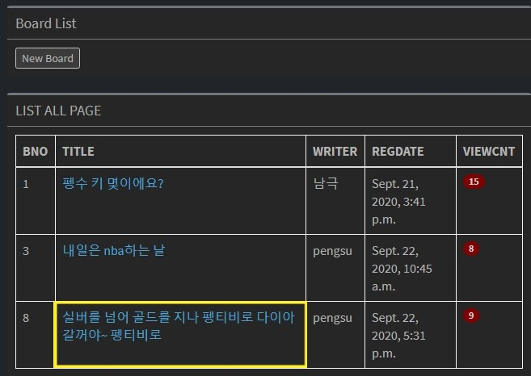
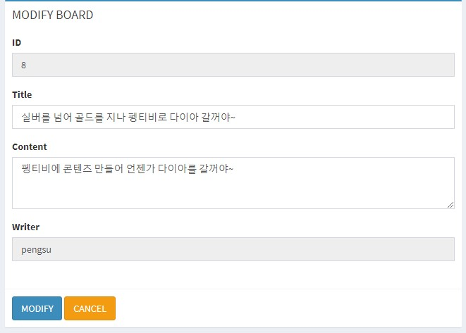
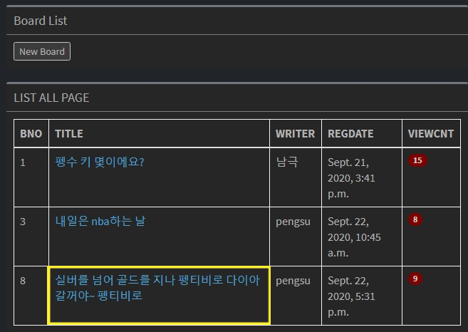
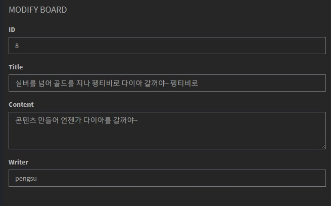
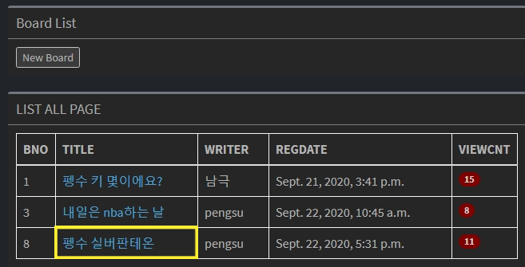
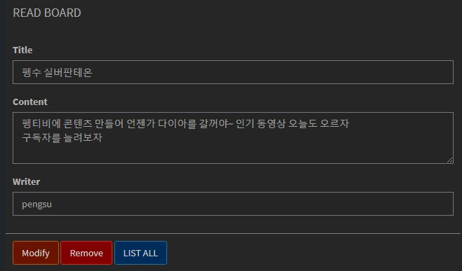
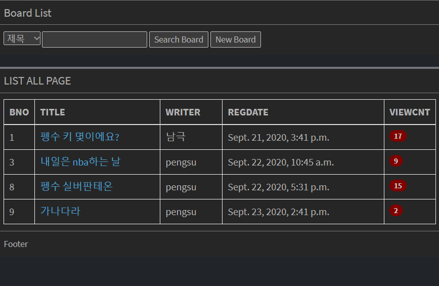
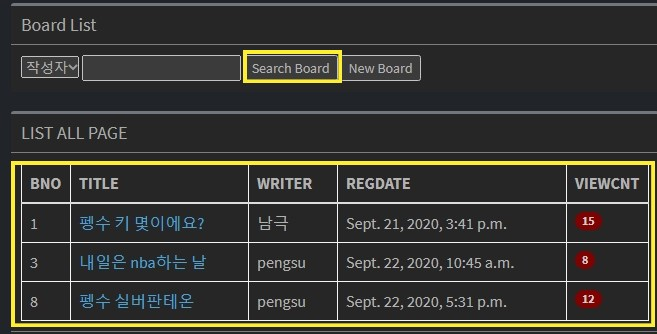
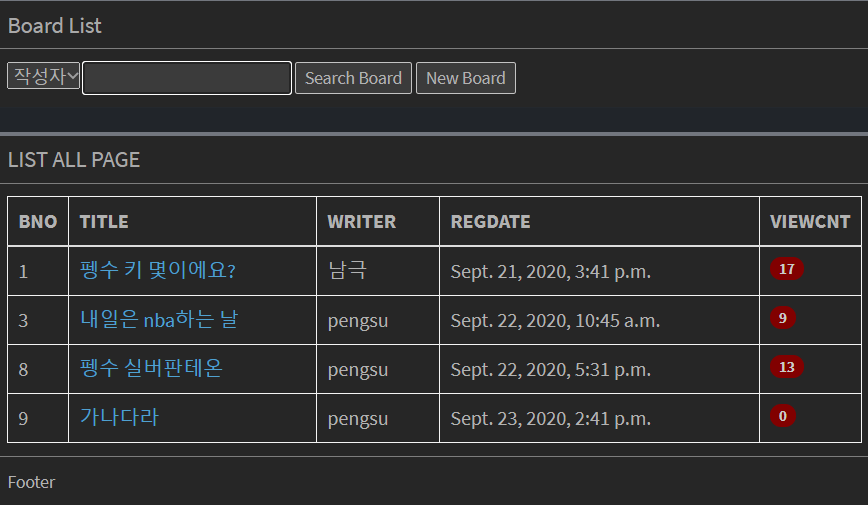

# 장고_Modify

- 게시글을 읽어왔을 때 `read.html` 코드를 보면

```html
<div class="box-body">
	<div class="form-group">
		<label for="exampleInputEmail1">Title</label> <input type="text"
			name='title' class="form-control" value="{{boards.title}}"
			readonly="readonly">
	</div>
	<div class="form-group">
		<label for="exampleInputPassword1">Content</label>
		<textarea class="form-control" name="content" rows="3"
			readonly="readonly">{{boards.content}}</textarea>
	</div>
	<div class="form-group">
		<label for="exampleInputEmail1">Writer</label> <input type="text"
			name="writer" class="form-control" value="{{boards.write}}"
			readonly="readonly">
	</div>
</div>
```

- `readonly="readonly"` 로 되어있기 때문에 수정이 불가능하다.

`modify.html` 에는 `title` 과 `content` 에 `readonly="readonly"` 없이 설정이 되어있어야 한다.

```html
<div class="form-group">
			<label for="exampleInputEmail1">ID</label> <input type="text"
				name='id' class="form-control" value="{{board.id}}"
				readonly="readonly">
		</div>

		<div class="form-group">
			<label for="exampleInputEmail1">Title</label> <input type="text"
				name='title' class="form-control" value="{{board.title}}">
		</div>
		<div class="form-group">
			<label for="exampleInputPassword1">Content</label>
			<textarea class="form-control" name="content" rows="3">{{board.content}}</textarea>
		</div>
```

- `title` 과 `content` 에 수정이 가능하게 코드가 구성되어 있다. 
- 그 전에 어떻게 `modify` 화면이 어떻게 나와야 하는지 보자.

- `read.html` 에 `Modify` 버튼이 있는 코드를 보면

```html
<button type="submit" class="btn btn-warning">Modify</button>
```

- 버튼을 클릭하면 어디로 연결되는지 링크가 없다. 스크립트로 속성을 부여해주자.

```html
$('.btn-warning').click(function(){
		$('#removeFrm').attr('action', '../bbs_modifyForm/')
		$('#removeFrm').submit();
	})
```

- `Modify` 버튼의 `class` 를 찾아서 다음과 같이 속성을 부여하고 실행시키는 코드를 추가시킨다.

#### Modify를 실행시키자

- `urls.py` 에 `bbs_modifyForm` `path` 를 추가시킨다.

```python
urlpatterns = [
    path('index/', views.loginForm, name='loginForm'),
    path('registerForm/', views.registerForm, name='registerForm'),
    path('register/', views.register, name='register'),
    path('login/', views.login, name='login'),
    path('logout/', views.logout, name='logout'),
    path('bbs_list/', views.list, name='bbs_list'),
    path('bbs_registerForm/', views.bbsRegisterForm, name='bbs_registerForm'),
    path('bbs_register/', views.bbsRegister, name='bbs_register'),
    path('bbs_read/<int:id>', views.bbsRead, name='bbs_read'),
    path('bbs_remove/', views.bbsRemove, name='bbs_remove'),
    path('bbs_modifyForm/', views.bbsModifyForm, name='bbs_modifyForm'),]
```

- `views.py` 에 `bbsModifyForm` 함수를 추가시킨다.

```python
def bbsModifyForm(request):
    id = request.POST['id']
    board = get_object_or_404(Bbs, pk=id)
    context = {'board' : board,
               'id': request.session['user_id'],
               'name': request.session['user_name']
               }
    return render(request, 'modify.html', context)
```

- 우선 수정하려고 하는 게시글의 `id` 를 알아야한다.

  - ```html
    <input type='hidden' name='id' value="{{boards.id}}">
    ```

  - `read.html` 에 숨겨져있던 `id` 를  받아서 찾는다.

- `id` 조건을 걸어 객체를 가져온다.

- 객체를 웹화면에 뿌릴려면 딕셔너리에 담아서 가져가야 한다. 

  - `session` 을 계속 지정해줘야 화면에서 넥네임이랑 아이디가 뜬다.

- 그럼 `modify.html` 로 가서 설정해주자.

```html


--------<body></body>------


```

- `<section>` 밖에 없으니 추가시켜준다.

```html
<div class="form-group">
			<label for="exampleInputEmail1">ID</label> <input type="text"
				name='id' class="form-control" value="{{board.id}}"
				readonly="readonly">
		</div>

		<div class="form-group">
			<label for="exampleInputEmail1">Title</label> <input type="text"
				name='title' class="form-control" value="{{board.title}}">
		</div>
		<div class="form-group">
			<label for="exampleInputPassword1">Content</label>
			<textarea class="form-control" name="content" rows="3">{{board.content}}</textarea>
		</div>
		<div class="form-group">
			<label for="exampleInputEmail1">Writer</label> <input
				type="text" name="writer" class="form-control"
				value="{{board.write}}"
				readonly="readonly">
```

- 해당되는 구역에 {{board.xxx}}로`print` 한다.
- 이제 웹페이지에서 실행해보자.



- 이 게시물을 클릭하면



- 이렇게 `MODIFY BOARD` 가 뜬다. 
  - 흰색 바탕이 실제로 값을 바꿀 수 있는 부분이다.
- 그럼 `Modify` 버튼을 클릭해서 실제로 값을 변경할 수 있게 하자.
- `modify.html` 로 가서 코드를 수정해보자.

```html
<div class="box-footer">
	<button type="submit" class="btn btn-primary">MODIFY</button>
	<button type="submit" class="btn btn-warning">CANCEL</button>
</div>
```

- 원래 `<form>` 안에 `<button>` 이 있으면 버튼을 클릭했을 때 `action` 으로 바로 갈 수 있다. 그러나 지금은 `<form>` 안에 있는게 아니라 바깥에 있다. 이러한 경우에는 `script` 를 건드려서 링크를 걸어주자.

```html
<script>
	$(document).ready(function() {
		$('.btn-primary').click(function(){
			$('#modifyFrm').submit();
		})
	});
</script>
```

- `MODIFY` 의 클래스 `btn-primary` 를 클릭했을 때 `Form` 의 `id` 를 찾아서 `action` 이 실행되도록 `.submit()` 을 준다. 

- 그럼 `Form` 의 `action` 에는 어떤 링크가 걸려있는지 보자.

```html
<form id="modifyFrm" role="form" method="post" action="">
```

- `bbs_modify` `url` 로 이동하라고 한다.

- `urls.py` 에 `bbs_modify` `path` 를 추가하자.

```python
urlpatterns = [
    path('index/', views.loginForm, name='loginForm'),
    path('registerForm/', views.registerForm, name='registerForm'),
    path('register/', views.register, name='register'),
    path('login/', views.login, name='login'),
    path('logout/', views.logout, name='logout'),
    path('bbs_list/', views.list, name='bbs_list'),
    path('bbs_registerForm/', views.bbsRegisterForm, name='bbs_registerForm'),
    path('bbs_register/', views.bbsRegister, name='bbs_register'),
    path('bbs_read/<int:id>', views.bbsRead, name='bbs_read'),
    path('bbs_remove/', views.bbsRemove, name='bbs_remove'),
    path('bbs_modifyForm/', views.bbsModifyForm, name='bbs_modifyForm'),
    path('bbs_modify/', views.bbsModify, name='bbs_modify'),]
```

- `views.py` 에 `bbsModify` 함수를 만들자.

```python
def bbsModify(request):
    id = request.POST['id']
    title = request.POST['title']
    content = request.POST['content']
    bbs = get_object_or_404(Bbs,pk=id)

    bbs.title = title
    bbs.content = content
    bbs.save()

    return redirect('bbs_list')
```

- 우선 `id` 는 위 사진에서 `ID` 라고 표시되어 있는 부분에 `name` 을 걸어줘서 얻어왔다. 
- 변경할 값이 `title` 과 `content` 니깐 값을 받아온다. 
- 그 다음에 `id` 를 기준으로 객체를 받아온다. 
- 값들을 변경해주고 저장한 다음  다시 `bbs_list` 로 돌아가게 한다. 
  - 화면에 뿌려주는게 아니라  DB에 있는 값을 변경하는 것이기 때문에 그렇다.











- 값이 정상적으로 변경된 것을 알 수 있다. 

#### 게시글 검색하기

- 이번에는 게시판에서 제목, 작성자를 검색해보자.

- `list.html` 로 가서 코드를 수정하자.

```html
<div class='box-body'>
					<select id="searchType">
						<option value="title">제목</option>
						<option value="write">작성자</option>
					</select>
					<input type="text" id="searchKeyword">
					<button id='searchBtn'>Search Board</button>
					<button id='newBtn'>New Board</button>
				</div>
```

- `New Board` 만 있던 곳에 `Search Board` 버튼을 추가시킨다. 
- 그 다음 `<select>` 와 `<option>` 을 추가하여 제목과 작성자를 선택할 수 있도록 한다.



- 이렇게 버튼과 검색창이 추가된다. 
- 검색했을 때 화면이 움직이지 않고 밑에 게시글만 다시 바뀌게 해보자.

#### Ajax 

- JavaScript의 라이브러이중 하나이며 Asynchronous Javascript And Xml(비동기식 자바스크립트와 xml)의 약자이다.

- 브라우저가 가지고있는 XMLHttpRequest 객체를 이용해서 전체 페이지를 새로 고치지 않고도 페이지의 일부만을 위한 데이터를 로드하는 기법 이며 Ajax를 한마디로 정의하자면 JavaScript를 사용한 비동기 통신, 클라이언트와 서버간에 XML 데이터를 주고받는 기술이라고 할 수 있겠다. (https://coding-factory.tistory.com/143)

  - **※ 비동기(async)방식이란?**

    비동기 방식은 웹페이지를 리로드하지 않고 데이터를 불러오는 방식입니다. 이 방식의 장점은 페이지 리로드의 경우 전체 리소스를 다시 불러와야하는데 이미지, 스크립트 , 기타 코드등을 모두 재요청할 경우 불필요한 리소스 낭비가 발생하게 되지만 비동기식 방식을 이용할 경우 필요한 부분만 불러와 사용할 수 있으므로 매우 큰 장점이 있습니다.

- 현재 `list.html` 을 보면 테이블들이  `action` 을 실행할 수 있는 `Form` 안에 없다.  

  - 스크립트에서 해결해야 한다.
  - 화면의 리로딩없이 틀을 유지하고 검색한 값을 보여준다.

```html
$.ajax({
				url : "",
				type : 'post',
				data : {'csrfmiddlewaretoken' : '{{csrf_token}}',
						type     : $('#searchType').val(),
						keyword  : $('#searchKeyword').val()
				},
				dataType : 'json',
```

- 제이슨 형식으로 값을 나중에 데이터에 심어야 하기 때문에 딕셔너리 형식으로 값을 지정해준다. 
  - `bbs_search` 로 이동하게 한다. 
  - `type` 는 `post` 형식이다. 
  - `post` 형식이니 `csrf_token` 을 추가해줘야 해서 추가해준다. 
  - `data` 에 내가 찾고 싶은 타입이 제목인지 작성자인지 판단해준다.
  - 키워드는 사용자가 입력하는 값을 받아온다. 
  - `dataType` 는 제이슨형식이다.
- 우선 이렇게 설정해놓고 `urls.py` 에 `bbs_search` `path` 를 추가한다. 

```python
urlpatterns = [
    path('index/', views.loginForm, name='loginForm'),
    path('registerForm/', views.registerForm, name='registerForm'),
    path('register/', views.register, name='register'),
    path('login/', views.login, name='login'),
    path('logout/', views.logout, name='logout'),
    path('bbs_list/', views.list, name='bbs_list'),
    path('bbs_registerForm/', views.bbsRegisterForm, name='bbs_registerForm'),
    path('bbs_register/', views.bbsRegister, name='bbs_register'),
    path('bbs_read/<int:id>', views.bbsRead, name='bbs_read'),
    path('bbs_remove/', views.bbsRemove, name='bbs_remove'),
    path('bbs_modifyForm/', views.bbsModifyForm, name='bbs_modifyForm'),
    path('bbs_modify/', views.bbsModify, name='bbs_modify'),
    path('bbs_search/', views.bbsSearch, name='bbs_search'),
]
```

- `views.py` 에 `bbsSearch` 함수를 만들자.

```python
def bbsSearch(request):
    type = request.POST['type']
    keyword = request.POST['keyword']
    print('type : ',type,'keyword : ',keyword)

    if type == 'title':
        boards = Bbs.objects.filter(title__startswith=keyword)
    if type == 'write' :
        boards = Bbs.objects.filter(write__startswith=keyword)
    data = []
    for board in boards :
        data.append({
            'id'       : board.id,
            'title'    : board.title,
            'writer'   : board.write,
            'regdate'  : board.regdate,
            'viewcnt'  : board.viewcnt
        })
    return JsonResponse(data, safe=False)
```

- `type` 를 받아와 `제목` 인지 `작성자` 인지 조건을 걸어 페이지에 리로딩해줘야 한다.
-  만약 `type` 가 `title` 이면 사용자가 입력한 글자로 시작하는 게시글의 객체를 담는다.
- 만약 `type` 가 `write` 면 사용자가 입력한 글자로 시작하는 게시글의 객체를 담는다.
- 받아온 객체로 for구문을 돌려야 게시글의 개수만큼 화면에 표시된다.
- data에 딕셔너리 형식으로 추가시켜준다. 
- `return` 은 기존의 `render` 나 `redirect` 로 해버리면 페이지 리로딩이 발생한다. 
  - 우리가 원하는건 페이지에 리로딩없이 바로 페이지에 데이터만 바꾸는 것이다.
  - 제이슨 형식만 읽을 수 있지만 `safe = False` 를 해주면 리스트여도 읽을 수 있다. 

```python
from django.http import HttpResponse,JsonResponse
```

- `JsonResponse` 을 `import` 해준다. 

그럼 `list.html` 에 가서 나머지 설정을 해주자.

```python
$('#searchBtn').click(function (){
			$('#tbody').empty()
$.ajax({
				url : "",
				type : 'post',
				data : {'csrfmiddlewaretoken' : '{{csrf_token}}',
						type     : $('#searchType').val(),
						keyword  : $('#searchKeyword').val()
				},
				dataType : 'json',
				success : function(data){
					var txt = "";
					var objid = 0;
					$.each(data , function(idx, obj) {
						txt +="<tr><td>"+obj.id+"</td>" ;
						txt +="<td><a href=../bbs_read/" + obj.id + ">"+ obj.title + "</td>";
						txt +="<td>"+obj.writer+"</td>";
						txt +="<td>"+obj.regdate+"</td>";
						txt +="<td><span class='badge bg-red'>"+obj.viewcnt+"</span></td></tr>" ;
					});
					$("#tbody").append(txt);
				}
```

- `searchBtn` 을 클릭하면 현재 게시판 글들이 있는 `tbody` 공간을 비워준다. 

  - 거기에 우리가 검색한 게시글들이 나와야 한다. 

- success로 데이터가 내려온다.

  1. `bbs_search` 로 가면 `bbsSearch` 함수가 실행된다.

  2. 거기서 데이터를 제이슨 형식으로 저장했다.
  3. 그럼 그 데이터가 `success` 로 가서 함수가 실행된다. 
  4. 내가 검색한 조건에 맞는 `object` 들이 담겨있다.
  5. 제이쿼리로 루프를 돌린다. 
  6. 그러면 `<tr>` 과 `<td>`  로 테이블을 만들어준다. 
  7. 그걸 txt에 저장하고 `id` 가 `tbody` 


- 지금 노란색인 칸에 내가 검색한 게시글이 리로딩없이 나타나게 한다. 	
  8.  게시글 `TITLE` 에 링크를 걸어 게시물을 클릭하면 내용을 보여주는 페이지로 이동한다. 

