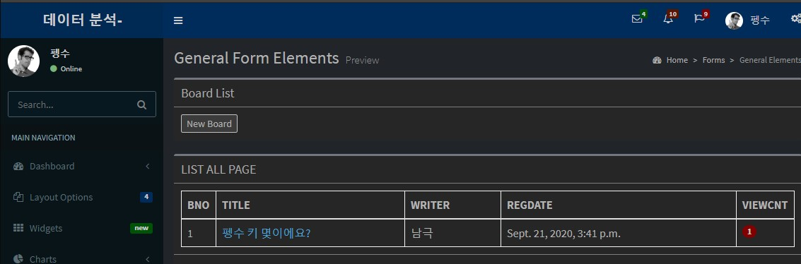
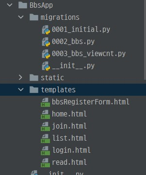
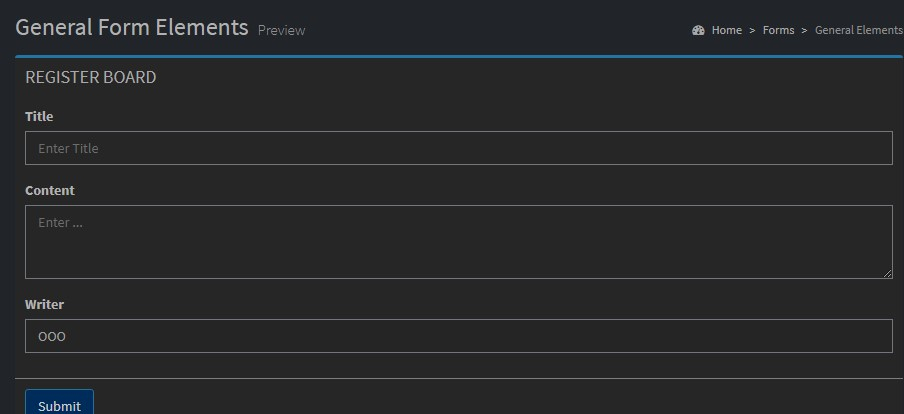
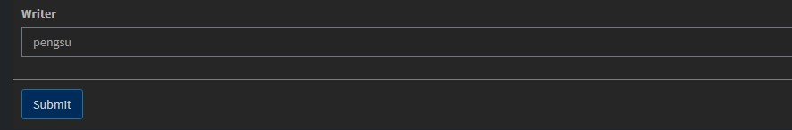
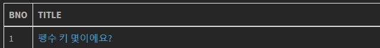
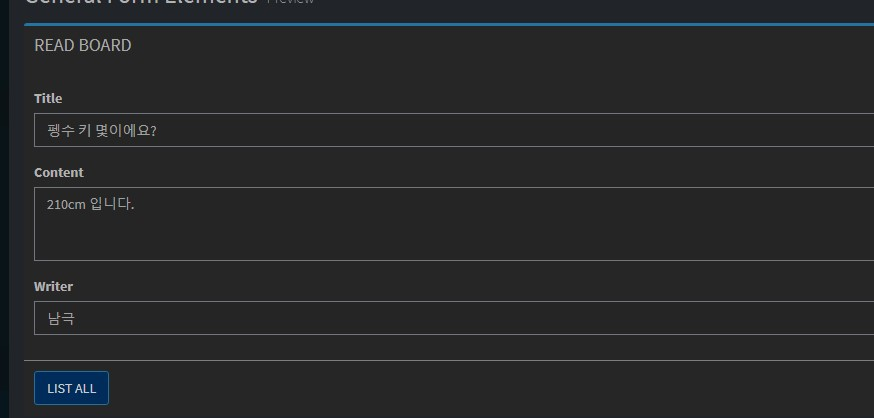
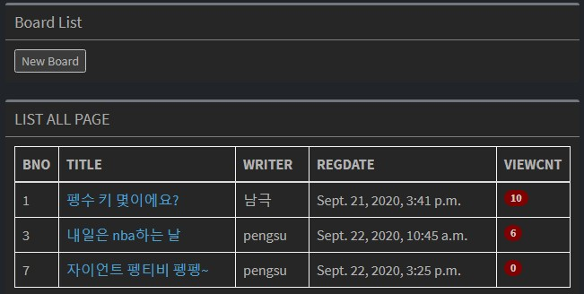
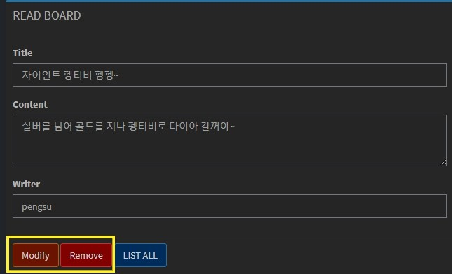
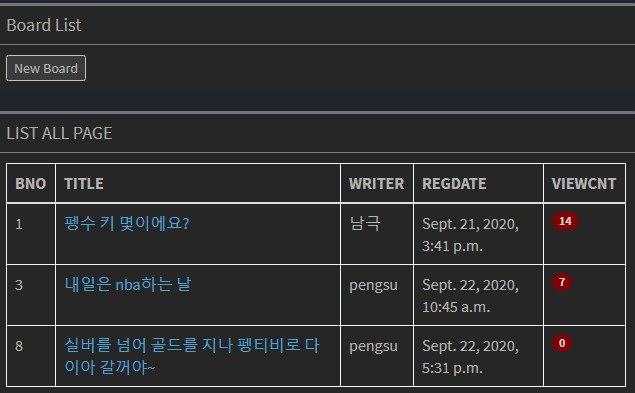

# 장고_read

### 게시판에 글 작성하고, 클릭하면 내용 보여주기

- 게시판에 글을 작성하고, 그 글을 불러오기위하여 `user_id` 가 필요하다.
  - 누가 쓴 글인지 알아야 한다.
- `session` 에  값을 하나 더 저장한다.
- `views.py` 에 `login` 함수를 수정한다.

```python
 if user is not None:
            request.session['user_name'] = user.user_name
            request.session['user_id'] = user.user_id
            context['name'] = request.session['user_name']
            context['id'] = request.session['user_name']
```

- context에 `id` 를 추가한다.
- `loginFoem` 으로 가서 코드를 약간 수정한다.
  - 로그인 한 상태에서 url에 `bbs/index/` 를 치면 다시 로그인 화면으로 가는것이 아니라 홈화면이 나오도록 설정한다.

```python
def loginForm(request):
    if request.session.get('user_id'):
        context = {'id' : request.session['user_id'],
                   'name' : request.session['user_name']}
        return render(request, 'home.html',context)

    return render(request, 'login.html')
```

- 만약에 `session `에 값이 있으면 `return` 을 `home.html` 로 가도록 설정한다.
- `session` 을 가져오는 방식에는 `get()` 과 `['컬럼이름']` 방식이 있다.

#### 장고에서 session을 건드릴 수 있는건 views 뿐이다.

- 그래서 `session` 을 다른 화면에서도 쓰고 싶으면 렌더링 될 때 마다 `session` 을 심어줘야 한다. 

- 우리가 `user_id` `session` 을 추가시켜 줬으니 `logout` 함수도 코드를 수정해야 한다.

```python
def logout(request):
    request.session['user_name'] = {}
    request.session['user_id'] = {}
    request.session.modified = True

    return redirect('loginForm')
```

- 게시판을 클릭했을 때 `session` 이 유지되지 않는 모습이었다. `list` 함수에도 `session` 을 추가시키자.

```python
def list(request):
    boards = Bbs.objects.all()
    print('boards result : ', type(boards), boards)
    context = {"boards" : boards,
               'id': request.session['user_id'],
               'name': request.session['user_name']
               }
    return render(request, 'list.html', context)
```



- 게시판을 클릭했을 때도 정상적으로 나온다.
- **New Board** 를 클릭하면 새로운 게시글을 작성할 수 있도록 하자.
- `list.html` 로 가서 **New Board** 버튼이 있는 곳을 찾아가자.

```html
<button id='newBtn'>New Board</button>
```

- 버튼에 `id` 가 부여되어 있다. 그러면 `script` 를 활용하여 버튼을 클릭하면 이벤트를 처리할 수 있게 하자.

```html
<script>
	$(document).ready(function(){
		$('#newBtn').click(function(){
			location.href = '../bbs_registerForm' ;
		})
	})
</script>
```

- jQuery (**제이쿼리**)를 사용하여 버튼 이벤트를 처리하였다. 
  - 게시판 글을 작성하려면 bbs/로 나와서  작업해야 한다.
    - `../bbs_registerForm` 그래서 `../` 를 하여 한 단계 위로 빠져나와서 `bbs_registerForm` url을 찾아간다.
  - `<a href="">` = `location.href`  랑 같다. 
    - 현재 `id='newBtn'`  에는 링크 걸려있는게 없다. 그러니 `$(제이쿼리)` 를 이용하여 링크를 걸어준다.
- `bbs_registerForm` 을 `urls.py` 에 `path` 로 추가시킨다.

```python
urlpatterns = [
    path('index/', views.loginForm, name='loginForm'),
    path('registerForm/', views.registerForm, name='registerForm'),
    path('register/', views.register, name='register'),
    path('login/', views.login, name='login'),
    path('logout/', views.logout, name='logout'),
    path('bbs_list/', views.list, name='bbs_list'),
    path('bbs_registerForm/', views.bbsRegisterForm, name='bbs_registerForm'),]
```

- 기존에 있던 `bbsRegisterForm.html` 을 `BbsApp` - `templates` 에 복사한다.



- 이제 `views.py` 에 가서 `bbsRegisterForm` 함수를 추가시켜주자.

```python
def bbsRegisterForm(request):
    context = {'id': request.session['user_id'],
               'name': request.session['user_name'] }
    return render(request, 'bbsRegisterForm.html', context)
```

- 게시글 작성중에도 `session` 이 유지되어야 하니깐 기존의 `session` 을 계속 가져온다.
- `bbsRegisterForm.html` 을 설정하러 가자.

```html


--------<body></body>------


```

- `bbsRegisterForm.html`  도 `<section>` 으로 시작하기 때문에 `header.html` 과 `footer.html` 을 불러온다.



- 이렇게 게시글을 등록할 수 있는 웹페이지가 뜬다.

#### 그럼 이제 게시글에 입력된 내용들을 **DB** 에 저장시켜보자.

- `bbsRegisterForm.html`  `id` 를 저장해서 넘겨받을 수 있도록 해보자.

```html
<input type="text"
				name="writer" class="form-control" readonly value="{{id}}">
```

- `readonly` 는 읽기만 가능하고 변경은 불가능하다.
-  `value="{{id}}"` 는 `name="writer"` 의 값을 `id` 로 지정한다는 뜻이다. 다른 곳에서 `name="writer"` 을 불러오면 `id` 의 값을 얻을 수 있다. 
  - 여기서 `id` 는 우리가 `session` 에 저장했던 `id` 이다.



- 게시물을 새로 만들 때 `writer` 에 이름이 뜨게 된다.
- `submit` 를 클릭하면

```html
<form role="form" method="post" action="">
```

- **DB** 에 저장할 수 있도록   `action` 을 지정해주자.

- `urls.py` 에  `bbs_register` `path` 를 추가시키자.

```python
urlpatterns = [
    path('index/', views.loginForm, name='loginForm'),
    path('registerForm/', views.registerForm, name='registerForm'),
    path('register/', views.register, name='register'),
    path('login/', views.login, name='login'),
    path('logout/', views.logout, name='logout'),
    path('bbs_list/', views.list, name='bbs_list'),
    path('bbs_registerForm/', views.bbsRegisterForm, name='bbs_registerForm'),
    path('bbs_register/', views.bbsRegister, name='bbs_register'),]
```

- `views.py` 에 `bbsRegister` 함수를 만들자.

```python
def bbsRegister(request):
    if request.method == 'GET' :
        return redirect('bbs_registerForm')
    elif request.method == 'POST':
        title   = request.POST['title']
        content  = request.POST['content']
        write = request.POST['writer']

        board = Bbs(title=title, write=write, content=content)
        board.save()
    return redirect('bbs_list')
```

- `title` , `content` , `write` 를 받아서 `Bbs` 함수에 값을 더해준다. 
  - 그럼 **DB** 에 새로운 값들이 저장된다.  
- 여기서 `redriect` 를 실행시키는 이유는 `render(request, 'bbs_list')` 를 하면 방금 입력했던 `title` , `content` , `write`  들을 읽어오지 못한다.

#### DB에 저장된 값들을 읽어보자.

- 게시물을 읽어오려면 서버쪽에 게시글의 pk값을 넘겨야 한다.
  - 누구의 글을 읽을 것인가?
    - `view` 가 사용자의 요청을 받아서 `model` 에 넘긴다.
    - 그럼 `model` 에서는 pk에 해당하는 조건을 걸어 `select` 한다.
    - 그러면 조건에 맞는 게시글 하나가 넘어온다.
    - `view` 에서 `template` 로 보낸다.
- 기존에 있던 `read.html` 파일을 `BbsApp` - `templates` 에 복사한다.
  - `read.html` 도 `<section>` 으로 시작하기 때문에 다음과 같은 코드를 추가한다.

```html


--------<body></body>------


```

- 다음으로 넘어가기 전에 웹페이지를 봐보자.



- 저기서 제목을 클릭하면 `read.html` 이 나오도록 설정해야 한다.
- `list.html` 로 가서 코드를 수정한다.

```html
<td><a href="">{{board.title}}</a></td>
```

- 링크를 걸어 `/bbs_read?id=해당 게시글의 id` 로 넘어가도록 설정해준다. 그럼 `urls.py` 로 가서 `path` 를 추가해주자.

```python
urlpatterns = [
    path('index/', views.loginForm, name='loginForm'),
    path('registerForm/', views.registerForm, name='registerForm'),
    path('register/', views.register, name='register'),
    path('login/', views.login, name='login'),
    path('logout/', views.logout, name='logout'),
    path('bbs_list/', views.list, name='bbs_list'),
    path('bbs_registerForm/', views.bbsRegisterForm, name='bbs_registerForm'),
    path('bbs_register/', views.bbsRegister, name='bbs_register'),
    path('bbs_read/<int:id>', views.bbsRead, name='bbs_read'),]
```

- `<int:id>` 우리가 링크로 걸려는 `id` 가 숫자이기 때문에 그거에 맞춰서 타입을 지정해준다. 
  - 내가 받아오는 형식은 **GET** 방식이다.
  - `http://localhost:8000/bbs/bbs_read/1`  사용자URL은 이런식으로 뜬다.
- `views.py` 로 가서 게시물을 읽을 수 있게`bbsRead` 함수를 만들자.

```python
def bbsRead(request,id):
    board = get_object_or_404(Bbs, pk=id)
    board.viewcnt += 1
    board.save()
    context = {'boards' : board,
               'id': request.session['user_id'],
               'name': request.session['user_name']
               }
    return render(request, 'read.html', context)
```

- **GET** 방식으로 받아오기때문에 `request` 옆에 `id` 를 같이 받아온다.
- 그 `id` 에 해당하는 `Bbs` 객체들을 가져와서 `viewcnt` 로 조회수를 증가시킨다.
  - `board = Bbs.objects.get(id(컬럼) = id(파라메타))` 형식으로 받아와도 된다.
- `context` 로 담아서 웹페이지에 뿌릴 것이기 때문에 `boards` 로 지정해주었고, 글을 쓰는 동안에도 `session` 은 나와야 하기 때문에 같이 담는다.
- 그럼 `read.html` 의 나머지를 지정해주러 가자.

```html
<div class="box-body">
	<div class="form-group">
		<label for="exampleInputEmail1">Title</label> <input type="text"
			name='title' class="form-control" value="{{boards.title}}"
			readonly="readonly">
	</div>
	<div class="form-group">
		<label for="exampleInputPassword1">Content</label>
		<textarea class="form-control" name="content" rows="3"
			readonly="readonly">{{boards.content}}</textarea>
	</div>
	<div class="form-group">
		<label for="exampleInputEmail1">Writer</label> <input type="text"
			name="writer" class="form-control" value="{{boards.write}}"
			readonly="readonly">
	</div>
</div>
```

- `bbsRead` 함수에서 `boards` 에 담았으니 그 객체 안에 있는  `title`, `content` , `write` 를 웹페이지에 나오도록 설정한다.



- 정상적으로 게시글을 읽어온다.

#### `LIST ALL` 버튼을 클릭하면 게시글 목록이 나오도록 설정해보자.

- `read.html` 에 들어가서 `LIST ALL` 버튼이 있는 코드를 수정한다.

```html
<button id="listBtn" type="submit" class="btn btn-primary">LIST ALL</button>
```

- 관리하기 쉽도록 `id="listBtn"` 를 추가해주고 지정된 `action` 이 없기 때문에 `scrtpt` 에서 꾸며준다.

```html
<script>
				
$(document).ready(function(){
	$('#listBtn').click(function(){
		location.href='../bbs_list' ;
});

</script>
```

- 제이쿼리 형식으로 버튼을 클릭했을 때 `'../bbs_list'` 로 이동하라고 링크를 걸어준다.



- 그럼 게시물 리스트로 넘어가게 된다.

#### 게시물 삭제와 수정

- `LIST ALL` 버튼 왼쪽에 `Modify` 와 `Remove` 버튼을 추가시켜보자.
- `read.html` 로 이동해서 코드를 추가시키자.

```html

<button type="submit" class="btn btn-warning">Modify</button>
<button type="submit" class="btn btn-danger">Remove</button>

```

- 여기서 조건이 있다. 게시글을 쓴 글쓴이와 현재 로그인한 사용자가 같아야지 버튼이 나오게 해야한다.
  - 여기서 `id` 는 `session` 으로 계속 가지고 다닌 `user_id` 고 `boards.write` 는 내가 `bbsRead` 함수에서 받아온 게시글을 쓴 `user_id` 다.

```
boards.write :  pengsu
context['id'] :  pengsu
```

- `print` 를 해보면 같다는 것을 알 수 있다. 이렇게 로그인 사용자와 게시글 작성자가 같으면 



- 다음과 같이 버튼이 정상정으로 출력된다.

- 그럼 `Remove` 버튼을 클릭했을 때 게시물이 삭제되도록 해보자.

#### 게시물 삭제

- 게시글의 번호(`id`)를 알아야 게시글을 삭제할 수 있다.
- `read.html` 로 가서 코드를 수정하자.

```html
<form role="form" method="post" id="removeFrm">

	
	<input type='hidden' name='id' value="{{boards.id}}">

</form>
```

- 보이지 않게 게시글의 `id` 의 값을 지정하였다. 

```html
<button type="submit" class="btn btn-danger">Remove</button>
```

- 현재 `Remove` 버튼에는 `submit` 으로 `action` 을 취하고 싶지만 `form` 에는 `action` 이 없다. `script` 에서 꾸며주자.

```html
<script>
				
$(document).ready(function(){
	$('#listBtn').click(function(){
		location.href='../bbs_list' ;
	})
	$('.btn-danger').click(function(){
		$('#removeFrm').attr('action', '../bbs_remove/')
		$('#removeFrm').submit();
	})
});

</script>
```

- `Remove` 의 `class="btn btn-danger"`  를 이용하여 함수를 준다.
  - `form` 의 `id` 를 찾아 `action` 속성을 부여한다. `bbs_remove` url 링크를 걸어준다.
  - 그 다음 `submit()` 을 줘서 발동시킨다. 그럼 `action` 이 실행된다.
- `BbsApp` - `urls.py` 에 `path` 를 추가한다.

```python
urlpatterns = [
    path('index/', views.loginForm, name='loginForm'),
    path('registerForm/', views.registerForm, name='registerForm'),
    path('register/', views.register, name='register'),
    path('login/', views.login, name='login'),
    path('logout/', views.logout, name='logout'),
    path('bbs_list/', views.list, name='bbs_list'),
    path('bbs_registerForm/', views.bbsRegisterForm, name='bbs_registerForm'),
    path('bbs_register/', views.bbsRegister, name='bbs_register'),
    path('bbs_read/<int:id>', views.bbsRead, name='bbs_read'),
    path('bbs_remove/', views.bbsRemove, name='bbs_remove'),
]
```

- `views.py` 에 `bbsRemove` 함수를 추가하러 가자.

```python
def bbsRemove(request):
       id = request.POST['id']
       Bbs.objects.get(id=id).delete()

    return redirect('bbs_list')
```

- `hidden` 으로 가져왔던 게시물 `id` 를 받아온다. 
- `Bbs` 에서  `id` 에 해당되는 객체를 찾아서 지운다.
  - `delete` 이기 때문에 따로 `save()` 할 필요는 없다.
- 그 다음 다시 게시물 목록 리스트로 `redirect` 한다.



-  `BNO` 7번 게시물이 정상적으로 삭제된 것을 볼 수 있다.
  - `BNO` 는 인덱스이기 신경 안써도 된다.