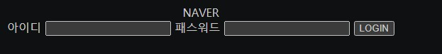
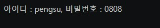
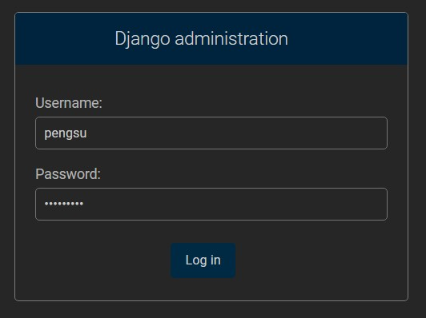
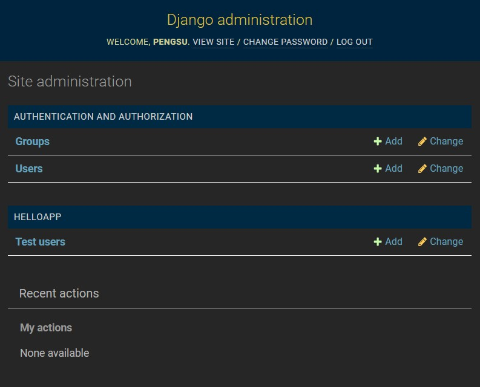
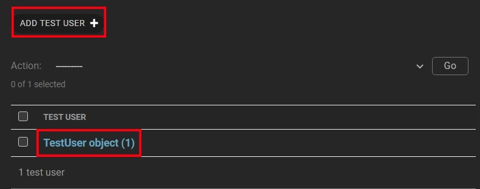
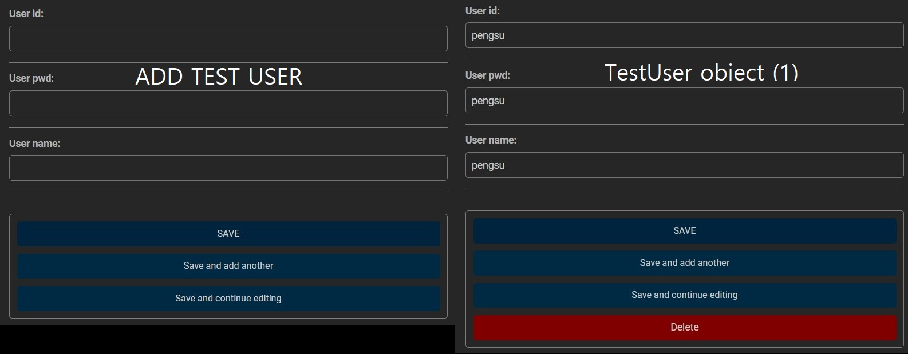
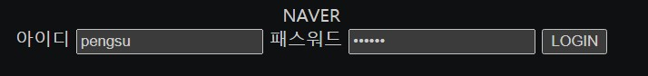

# 장고 시작

> 파이참에서 django를 설치하여 진행하였다.

## 장고란?

- **장고(Django)**는 파이썬으로 만들어진 무료 오픈소스 웹 애플리케이션 프레임워크다. 웹사이트 개발에 자주 사용하는 요소들을 갖춘 Tool이라고 보면 된다.
- 장고는 Model, View, Control 로 관리하는 MTV 모델이다.

### Terminal에 입력

- 우선 프로젝트를 하나 만든다.
- 그 다음에 Terminal에 다음과 같이 입력해준다.

```
(base) C:\Users\gh\PycharmProjects\wenSample2>django-admin startproject '원하는 이름' -> 편의상 django
```

- 그러면 `wenSample2`밑에 내가 입력한 이름의 디렉토리가 생긴다.

```
(base) C:\Users\gh\PycharmProjects\wenSample2>cd 'django'
```

- 해당 폴더로 들어간다.

```
(base) C:\Users\gh\PycharmProjects\wenSample2\django>dir/w
```

#### 해당 폴더에서 `manage.py`가 있는지 꼭 확인한다.

```
(base) C:\Users\gh\PycharmProjects\wenSample2\django>python manage.py startapp '원하는 앱 이름' -> 편의상 djangoApp
```

- 앱을 만들어서 그 안에서 html을 만들어서 연결 시켜주려고 한다. 그렇기 때문에 app폴더를 하나만든다.

- 처음 만들었던 `django`에서 설정을 해주어야 한다. 

  - `django` -> `settings.py`로 들어간다.

  - ```python
    ALLOWED_HOSTS = [] 를 ALLOWED_HOSTS = ['127.0.0.1', 'localhost']로 바꿔준다.
    ```

  - ```python
    INSTALLED_APPS = [
        'django.contrib.admin',
        'django.contrib.auth',
        'django.contrib.contenttypes',
        'django.contrib.sessions',
        'django.contrib.messages',
        'django.contrib.staticfiles',
        'djangoApp' <- 이것도 추가한다.
    ]
    ```

  - ```python
    TIME_ZONE = 'Asia/Seoul' <- 이것도 한국 시간대로 바꿔준다.
    ```

- 그 다음` django` -> `urls.py`에서 코드를 입력해준다.

  - ```python
    from django.contrib import admin
    from django.urls import path, include
    
    urlpatterns = [
        path('admin/', admin.site.urls),
        path('django/', include('djangoApp.urls'))
    ]
    ```

  - http://localhost:8000/django/를 하면 `djangoApp.urls`여기가 연결되게 하는 것이다.

  - 그러나 현재 `djangoApp`에는 `urls.py`가 없다. 그래서 `djangoApp`밑에 `urls.py`를 하나 만들어준다.

- `djangoApp`-`urls.py`에 `django`-`urls.py`의 내용을 복사해준다.

  - ```python
    from django.contrib import admin
    from django.urls import path, include
    from djangoApp import views 
    
    urlpatterns = [
        path('idx/', views.index),
    ]
    ```

  - **from `djangoApp` import `views `** 에서 `views`를 통해 웹 페이지에 내용을 보여줄 것이다.

  - `http://localhost:8000/django/idx `를 하면 **`views.index`**로 이동하여 이쪽에 있는 함수 내용을 보여주는 것이다.

- `djangoApp`-`views.py`에 웹페이지에 표시할 함수를 만든다.

  - ```python
    from django.shortcuts import render, HttpResponse
    # Create your views here.
    
    def idx(request):
        return render(request, 'django/idx.html')
    ```

  - 위 주소를 입력하면  **`'django/idx.html'`**에 있는 html의 내용이 나오도록 하는 함수다.

- 장고는 템플릿에 있는 내용을 가져와 보여주기에 `templates`폴더를 `djangoApp`밑에 만들어준다.

  - `templates`밑에 내가 관리할 `django`폴더를 하나 더 만들어 준다.
    - 폴더를 따로 따로 만들지 않을 경우 나중에 충돌할 가능성이 있다.
    - 폴더별로 만드는게 관리하기 더 쉽다.

- `templates`-`django` 밑에 **`idx.html`**파일을 하나 만든다.

  - ```html
    <body>
        <center>NAVER</center>
    
        <div align="center">
            <form method="post" action="">
    
                
    
                <label>아이디</label> <input type="text" name="id"/>
                <label>패스워드</label> <input type="password" name="pwd"/>
                <input type="submit" value="LOGIN" />
            </form>
        </div>
    
    </body>
    ```

  - `<body></body>`태그 사이에 원하는 내용을 넣고 저장을 한다. 

  - 장고에서 `method=post`방식에서는 **``**넣어주어야 한다.

  - `LOGIN`버튼을 눌렀을 경우 `action=""`을 실행한다. 

    - `urls.py`에 `login`으로 연결하라는 의미이다.
    - 여기서 `login`함수가 또 필요하다는 걸 알 수 있다.

```
(base) C:\Users\gh\PycharmProjects\wenSample2\django>python manage.py runserver
```

- **`python manage.py runserver`** 를 타이핑해서 서버를 가동시킨다. 
  - 오류가 없는 것을 확인하고 실행한다.

- `http://localhost:8000/django/idx`를 웹에 입력하면 다음과 같은 화면이 나온다.



- 로그인을 클릭하면 사용자의 아이디와 패스워드 정보가 나타내게 하려면 다음과 같다.

- `djangoApp`-`urls.py`에 path를 추가한다.

  - ```python
    urlpatterns = [
        path('idx/', views.idx),
        path('login/', views.login, name='login') 
    ]
    ```

- 주소가 `http://localhost:8000/django/login/`으로 바뀌면서 views에 login함수를 부른다. name을 준 이유는 다른 `path`에서 또 다른 `path`를 요청해야 할 경우도 있기 때문이다.

- `djangoApp`-`views`에 `login`함수를 추가한다.

  - ```python
    def login(request):
        if request.method == 'POST':
            id = request.POST['id']
            pwd = request.POST['pwd']
            context = {'id' : id, 'pwd' : pwd}
            return render(request, 'django/success.html', context)
    ```

  - `POST`방식으로 받아왔기 때문에 `id`와 `pwd`를 위의 방법처럼 받아와서 `context`에 딕셔너리 형식으로 담아준다.

  - `context`에는 `key`와 `value`값이 있으므로 `success.html`에서 표현방법을 나타내줘야한다.

  - `login`함수가 `success.html`를 호출한다.

- `templates`-`django`에 **`success.html`**을 추가한다.

  - ```html
    <body>
        아이디 : {{id}}, 비밀번호 : {{pwd}}
    </body>
    ```



- 다음과 같은 웹페이지가 나온다. 펭수의 생일인 8월 8일을 비밀번호로 입력하였다.

### MODEL과 연결하기

- 로그인 정보를 입력하면 그 정보를 저장했다가 MODEL과 비교하여 웹페이지에 출력한다.

- 그러기 위해서 **모델 마이그레이션** 이 필요하다.

  - 사용자 모델 -> DB(테이블) 만드는 명령어다.

  - ```
    (base) C:\Users\gh\PycharmProjects\wenSample2\django>python manage.py makemigrations
    ```

  - **python manage.py makemigrations** 를 타이핑해준다.

  - ```
    (base) C:\Users\gh\PycharmProjects\wenSample2\django>python manage.py migrate
    ```

  - **python migrate** 를 타이핑해준다.

- 그 다음 `djangoApp` - `models.py` 로 가서 class를 만들어준다.

  - ```python
    class User(models.Model):
        user_id =   models.CharField(max_length=50)
        user_pwd =  models.CharField(max_length=50)
        user_name = models.CharField(max_length=50)
    ```

  - `models.Model` 을 상속받는다.

  - 사용자의 `id` , `pwd`, `name` 을 `models.CharField` 로 부터 받아 지정해준다.

- 그 다음에 `djangoApp` - `admin.py` 으로 가서 **admin** 권한을 부여한다.

  - ```python
    from .models import *
    
    # Register your models here.
    admin.site.register(TestUser)
    
    ```

  - `from .models import *` 은 현재 `models.py` 에 만들어 놓은 함수를 모두 쓰겠다는 것이다. 현재 `class` 를 만들어 놓았기 때문에 그거 쓰겠다는 뜻이다.

  - `admin.site.register(TestUser)` 에서 등록을 하면 그 정보를 보여준다.

- **DB(테이블)** 이 잘 만들어졌는지 `superuser` 를 만들어서 관리한다.

  -  ```
    (base) C:\Users\gh\PycharmProjects\wenSample2\django>python manage.py createsuperuser
     ```

  - **`python manage.py createsuperuser`** 을 타이핑해준다. 

  - ```
    Username (leave blank to use 'gh'):
    Email address:
    Password: 
    Password (again):
    Bypass password validation and create user anyway? [y/N]: y
    Superuser created successfully.
    ```

  - 그러면 다음과 같이 입력하라고 뜨고 위에서 하나씩 해결해가면 된다.

    - `Password` 는 숫자를 써도 보이지 않지만 값이 들어간 것이다. 

### Django administration 접속

- `http://localhost:8000/admin/` 에 접속하면 다음과 같은 웹페이지가 뜬다.



- `Username` 와 `Password` 에는 위에서 입력한 값들을 입력해준다. 아래와 같은 페이지로 이동한다.

  

- `Test users` 를 클릭한다.

  

- `ADD TEST USER` 를 클릭하여 새로운 유저를 만들거나, 이미 만들었으면 아래와 같이 `TestUser object (1)` 이 뜬다.

  

- 등록을 완료했으면 잘 입력되었는지 확인해본다.

- `http://localhost:8000/django/idx` 에 다시 접속한다.

  

#### 꼭 !!! 위에서 입력했던 **아이디**와 **패스워드**를 동일하게 입력해준다.

- 그 전에 `LOGIN` 의 값을 변경해주어야 한다. 아까는 단순히 웹에서 입력한 값을 받아온 것이었다면 지금은 위에서 입력한 값을 빼와서 웹에서 입력한 값과 비교하고 보여주는 것이다.

  - `djangoApp` - `views.py` 로 다시 간다.

  - ```python
    def login(request):
        if request.method == 'POST':
            id = request.POST['id']
            pwd = request.POST['pwd']
            user = TestUser.objects.get(user_id = id)
            context = {}
            if user is not None :
                context['user'] = user
            return render(request, 'hello/success.html', context)
    ```

  - 웹에서 입력한 `id` 와 `user_id` 가 일치하면 값을 가져오고, 만약에 `user` 의 값이 `None` 값이 아니면 `context` 에 딕셔너리 형식으로 담아준다. 

  - `context` 의 값을 웹에 나타내주기 위해서는  `success.html` 의 값도 변경해주어야 한다.

- `templates` - `django` - `success.html` 에서 다음과 같이 값을 변경해준다.

  - ```html
    <body>
        아이디 : {{user.user_id}}, 비밀번호 : {{user.user_pwd}}, 이름 : {{user.user_name}}
    </body>
    ```

  - 딕셔너리 안에 있는 `user` 의 `user_id` 와 `user_pwd` 와 `user_name` 을 웹페이지에 표시해주도록 한다.

  - `models.py` - `class` 에서 만들었던 `user_목록` 들이다.

- 이렇게 설정 한 후 로그인을 하면

- ```
  아이디 : pengsu, 비밀번호 : pengsu, 이름 : pengsu
  ```

- 최종적으로 위와 같은 값이 나오는 페이지에 도착하게 된다. 