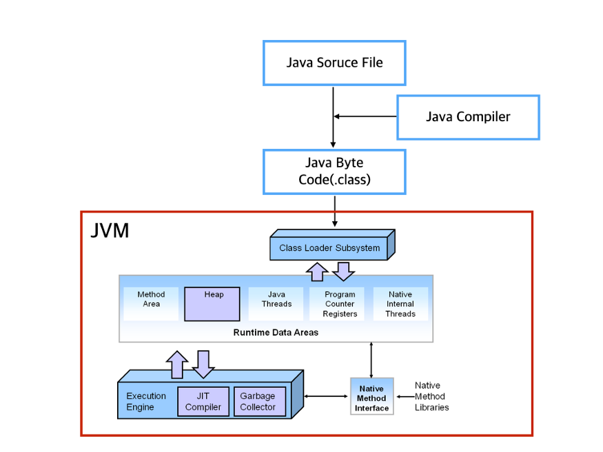
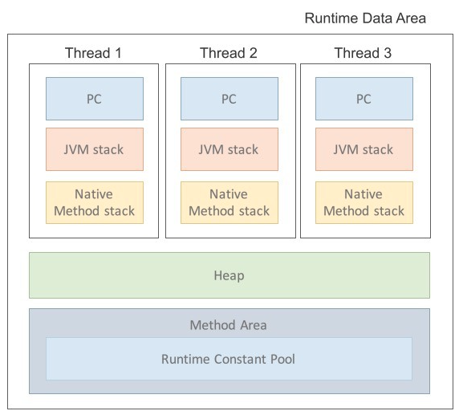

# [백기선] 1주차 과제: JVM은 무엇이며 자바 코드는 어떻게 실행하는 것인가

### 1.  JVM이란 무엇인가

- Java Virtual Machine의 줄임말
- Java Byte Code를 OS에 맞게 해석해주는 역할을 함
  - Byte Code는 기계어가 아니기 때문에 OS에서 바로 실행되지 않음
  - JVM이 Byte Code를 이해할 수 있도록 해석해줌
    - 즉, OS에 구애받지 않고 JAVA를 재사용 가능하게 함

- 메모리관리, Garbage, collection을 수행함

###  2. 컴파일 하는 방법

1. 시스템 환경변수에 자바 bin url을 등록한다.
2. .java 파일을 javac로 컴파일 한다.
   1. javac는 자바 컴파일러로 자바로 작성된 소스코드를 바이트코드로 변환함
3. 생성된 .class 파일을  java 클래스명으로 컴파일한다.
4. 그러면 class 파일이 실행된다.

###  3. 실행하는 방법

 	1. 프로그램이 실행되면 JVM은 OS로부터 이 프로그램이 필요로 하는 메모리를 할당받음
      	1. JVM은 이 메모리를 용도에 따라 여러 영역으로 나누어 관리
 	2. 자바 컴파일러(javac)가 자바 소스코드(.java)를 읽어들여 자바 바이트코드(.class)로 변환시킴
 	3. Class Loader를 통해 class 파일들을 JVM으로 로딩
 	4. 로딩된 class 파일들을 Execution engine을 통해 해석함
 	5. 해석된 바이트코드는 Runtime Data Areas에 배치되어 실질적인 수행이 이루어지게 됨

### 4. 바이트코드란 무엇인가

- 특정 하드웨어가 아닌 가상 컴퓨터에서 돌아가는 실행프로그램을 위한 이진 표현법
- 하드웨어가 아닌 소프트웨어에 의해 처리되기 때문에, 보통 기계어보다 더 추상적임

### 5. JIT 컴파일러란 무엇이며 어떻게 동작하는지

- Just-In-Time의 약자

- 인터프리터 방식의 단점을 보완하기 위해 도입됨
- 인터프리터 방식으로 실행하다가 적절한 시점에 바이트 코드 전체를 컴파일하여 native 코드로 변경함
  - 이후에는 더 이상 인터프리팅 하지 않고 네이티브 코드로 직접 실행함
  - native 코드란
    - CPU와 운영체제가 직접 실행할 수 있는 코드
    - 즉, 기계가 바로 읽고 수행 가능한 코드
- 네이티브 코드는 캐시에 보관하기 때문에 한 번 컴파일된 코드는 빠르게 수행됨
- JIT 컴파일러가 컴파일 하는 과정은 바이트 코드를 인터프리팅 하는 것보다 훨씬 오래걸림
- 한 번만 실행되는 코드라면 컴파일 하지 않고 인터프리팅 하는 것이 유리
- JIT 컴파일러를 사용하는 JVM들은 내부적으로 특정 메서드가 얼마나 자주 수행되는지 확인하고, 일정 정도를 넘을 때에만 컴파일을 수행

### 6. JVM 구성 요소

1. Class Loader(클래스 로더)

   - 자바는 클래스로 만들어지고 수천개의 클래스로 구성될 수 있음

   - JVM내로 클래스(.class)를 로드하고, 링크를 통해 배치하는 작업을 수행하는 모듈
   - Runtime시에 동적으로 클래스를 로드함
   - .jar 파일 내 저장된 클래스들을 JVM위에 탑재하고 사용하지 않는 클래스들을 메모리에서 삭제함
   - (컴파일러 역할) 자바는 동적코드, 컴파일 타임이 아니라 런타임에 참조함
     - 즉, 클래스를 처음으로 참조할 때, 해당 클래스를 로드하고 링크한다는 것
   - 이 역할을 클래스 로더가 수행함

2. Execution Engine(실행 엔진)

   - Load된 Class의 ByteCode를 실행하는 Runtime Module
   - 클래스를 실행시키는 역할
   - 클래스 로더가 JVM내의 런타임 데이터 영역에 바이트 코드를 배치시키고, 이것은 실행엔진에 의해 실행됨
   - 자바 바이트코드는 기계가 바로 수행할 수 있는 언어보다는 비교적 인간이 보기 편한 형태로 기술된 것
   - 실행 엔진은 이와 같은 바이트코드를 실제로 JVM내부에서 기계가 실행할 수 있는 형태로 변경함
   - Class Loader를 통해 JVM 내의 Runtime Data Areas에 배치된 바이트 코드는 실행 엔진에 의해 실행되며, 실행 엔진은 자바 바이트 코드를 명렁어 단위로 읽어서 실행

   1. InterPreter(인터프리터)
      1. JVM 실행 엔진이 바이트 코드를 명렁어 단위로 읽어서 실행함
      2. 한 줄 씩 수행하는 인터프리터 언어의 단점을 똑같이 갖고 있기 때문에 느림

3. Runtime Data Area

   - 운영체제로 부터 할당받은 메모리 공간

| 영역                       | 설명                                                         |
| -------------------------- | ------------------------------------------------------------ |
| PC Register                | 프로그램의 실행은 CPU에서 명렁어, 즉 Instruction을 수행하는 과정으로 이루어진다. CPU는 이러한 Instruction을 수행하는 동안 필요한 정보를 레지스터라고 하는 CPU내의 기억장치를 사용한다. Java의 PC Register는 CPU내의 기억장치인 레지스터와는 다르게 작동한다. Register - Base가 아닌 Stack - Base로 동작한다. PC Register는 각 Thread 별로 하나 씩 존재하며 현재 수행 중인 Java Virtual Machine Instruction의 주소를 가지게 된다. 만일 Nativa Method를 수행 한다면 PC Register는 Undefined 상태가 된다. 이 PC Register에 저장되는 Instruction의 주소는 Native Pointer 일 수도 있고 Method Bytecode일 수도 있다. Native Method를 수행할 때에는 JVM을 거치지 않고 API를 통해 바로 수행하게 된다. 이는 Java Platform에 종속 받지 않는다는 것을 보여준다 |
| Java Virtual Machine Stack | Java virtual Machine Stacks은 Thread의 수행 정보를 Frame을 통해서 저장하게 된다. Java Virtual Machine Stacks는 Thread가 시작될 때 생성되며, 각 Thread별로 생성이 되기 때문에 다른 Thread는 접근할 수 없다.  Method가 호출 되면 Method와 Method 정보는 Stack에 쌓이게 되며 Method 호출이 종료 될 때 Stack point에서 제거 된다. Method 정보는 해당 Method의 매개변수, 지역변수, 임시변수 그리고 어드레스(메소드 호출 한 주소)등을 저장하고 Method 종료시 메모리 공간이 사라진다. |
| Native Method Stack        | Java외의 언어로 작성된 네이티브 코드들을 위한 Stack, 즉 JNI(Java Native Interface)를 통해 호출 되는 C/C++ 등의 코드를 수행하기 위한 Stack Native Method를 위해 Native Method Stack이라는 메모리 공간을 갖는다. Application에서 Native Method를 호출하게 되면 Native Method Stack에 새로운 Stack Frame을 생성하여 Push 한다. 이는 JNI를 이용하여 JVM 내부에 영향을 주지 않기 위함이다. |
| Method Area                | 모든 쓰레드가 공유하는 메모리 영역이다. Method Area는 클래스, 인터페이스, 메소드, 필드, Static 변수 등의 바이트 코드 등을 보관 |
| Heap                       | 프로그램 상에서 런타임 시 동적으로 할당하여 사용하는 영역, class를 이용해 Instance를 생성하면 Heap에 저장된다. |

[출처]https://asfirstalways.tistory.com/158

### 7. JDK와 JRE의 차이

- JRE
  - Java Runtime Environment의 약자
  - 자바 프로그램을 실행시키는 데 필요한 라이브러리, java 명령어, JVM 등을 의미함
  - 환경적인 요소이기 때문에 JRE만 가지곤 새로운 프로그램을 개발 할 수 없음
- JDK
  - Java Develoment Kit의 약자
  - JRE 뿐 아니라 새로운 프로그램을 개발하기 위한 라이브러리, javac 명령어 등을 포함
  - 자바 프로그래머는 JDK를 받아 사용
  - java9 버전부터는 JRE가 따로 만들어지지 않고, JDK에 패키징되어 출시되는 중

## 참고

https://jeongjin984.github.io/posts/JVM/

https://medium.com/@lazysoul/jvm-%EC%9D%B4%EB%9E%80-c142b01571f2

https://velog.io/@maigumi/1.-JVM%EA%B3%BC-%EC%9E%90%EB%B0%94-%EC%BD%94%EB%93%9C%EC%9D%98-%EC%8B%A4%ED%96%89-%EB%B0%A9%EB%B2%95

https://siahn95.tistory.com/entry/Java-JVM%EC%9D%B4%EB%9E%80-3-JVM%EC%9D%98-%EB%91%90-%EA%B0%80%EC%A7%80-%EA%B5%AC%EC%84%B1-%EC%9A%94%EC%86%8C