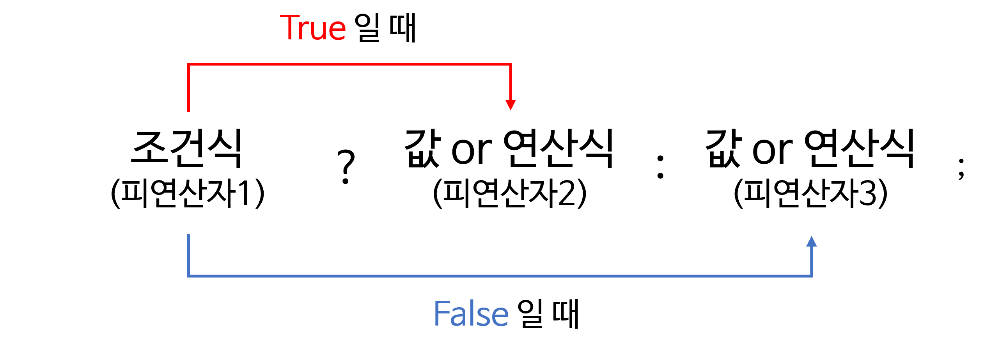

# [백기선] 3주차 과제: 연산자

## 산술 연산자

#### 산술 연산자 종류

| 구분       | 연산자 | 의미             |
| ---------- | ------ | ---------------- |
| 산술연산자 | +      | 더하기           |
|            | -      | 빼기             |
|            | *      | 곱하기           |
|            | /      | 나누기           |
|            | %      | 나머지 값 구하기 |

## 비트 연산자

> 데이터를 비트 단위로 연산

- 0과 1로 표현이 가능한 정수 타입이나 정수형으로 캐스팅이 가능한 자료형만 비트 연산 가능

#### 비트 연산자 종류

| 연산식  | 설명                                                         | 예시                                    |
| ------- | ------------------------------------------------------------ | --------------------------------------- |
| x<<y    | 정수 x의 각 비트를 y만큼 왼쪽으로 이동시킨다.(빈자리는 0으로 채워진다.) |                                         |
| x >> y  | 정수 x의 각 비트를 y만큼 오른쪽이로 이동시킨다.(빈자리는 정수 a의 최상위 부호 비트와 같은 값으로 채워진다.) |                                         |
| x >>> y | 정수 x의 각 비트를 y만큼 오른쪽으로 이동시킨다.(빈자리는 0으로 채워진다.) |                                         |
| ~       | 비트의 반전(1의 보수)                                        | a = ~a                                  |
| &       | 비트 단위 AND                                                | 1 & 1 1반환 그 외는 0                   |
| \|      | 비트 단위 OR                                                 | 0\|0  0반환 그 외는 1                   |
| ^       | 비트 단위 XOR                                                | 두개의 비트가 서로 다른 경우에 1을 반환 |

#### 예시

##### 2 << 3

```
00000000 00000000 00000000 00000010  2
```

```
vvv                                  vvv
000 00000000 00000000 00000000 000010??? 16
```

- 2를 32비트로 분해한 다음 밑에처럼 왼쪽으로 3비트를 이동시키면 왼쪽 3비트는 밀려서 버려지게 되고 맨 오른쪽은 0으로 채워진다.
- 그래서 16이 된다.

##### -16 >> 3

```
                                vvv
11111111 11111111 11111111 11110000  -16
```

```
vvv
11111111 11111111 11111111 11111110  -2
```

- 16비트를 32로 분해한 다음 오른쪽으로 3비트 이동시킨다.
- 맨 오른쪽 3비트는 밀려서 버려지게되고 맨 왼쪽은 최상위 부호비트와 동일한 값으로 채워진다.

##### -16 >>>3

```
                                vvv
11111111 11111111 11111111 11110000 -16
```

```
vvv
00011111 11111111 11111111 11111110  536870910
```

- 오직 자바에만 있는 연산이고 >>와 원리는 같다.
- 오른쪽 3비트로 이동하면 오른쪽 3비트는 버려지게 되고 맨 왼쪽은 0으로 채워진다.
  - 0으로 채워지기 때문에 결과는 무조건 양수가 된다.

## 관계 연산자

#### 관계 연산자 종류

| 연산자 | 기능                                                         | 연산 예   |
| ------ | ------------------------------------------------------------ | --------- |
| >      | 왼쪽 항이 크면 참을, 아니면 거짓을 반환한다.                 | num > 3;  |
| <      | 왼쪽 항이 작으면 참, 아니면 거짓을 반환한다.                 | num < 3;  |
| >=     | 왼쪽 항이 오른쪽 항보다 크거나 같으면 참, 아니면 거짓을 반환한다. | num >= 3; |
| <=     | 왼쪽 항이 오른쪽 항보다 작거나 같으면 참, 아니면 거짓을 반환한다. | num <= 3; |
| ==     | 두 개 항의 값이 같으면 참, 아니면 거짓을 반환한다.           | num == 3; |
| !=     | 두 개 항이 다르면 참, 아니면 거짓을 반환한다.                | num != 3; |

## 논리 연산자

#### 논리 연산자 종류

| 연산자         | 기능                                                         | 연산 예                            |
| -------------- | ------------------------------------------------------------ | ---------------------------------- |
| &&(논리 곱)    | 두 항이 모두 참인 경우에만 결과 값이 참이다. 그렇지 않은 경우 모두 거짓이다. | booleanval = (6 > 4) && (6 > 3);   |
| \|\| (논리 합) | 두 항 중 하나의 항만 참이면 결과 값은 참이다. 두 항이 모두 거짓이면 결과 값은 거짓이다. | booleanval = (6 > 4) \|\| (6 < 3); |
| ! (부정)       | 단한 연산자다. 참인 경우는 거짓으로 바꾸고, 거짓인 경우는 참으로 바꾼다. | booleanval = !(5 > 2);             |

## instanceof

- 객체 타입을 확인하는 연사자다.
- 형변환 가능 여부를 확인하며 true/ false로 결과를 반환한다.
- 주로 상속 관계에서 부모 객체인지 자식 객체인지 확인하는데 사용한다.
- 형변환이 불가능한(타입이 상위클래스도 하위클래스도 아닐경우) 에러가 발생한다.

###### 기본 사용방법

- 객체 instanceof 클래스

```java
class Parent{} 
class Child extends Parent{} 
public class InstanceofTest { 
    public static void main(String[] args){ 
        Parent parent = new Parent(); 
        Child child = new Child(); 
        System.out.println( parent instanceof Parent ); // true 
        System.out.println( child instanceof Parent ); // true
        System.out.println( parent instanceof Child ); // false 
        System.out.println( child instanceof Child ); // true 
    } 
}
```

- `System.out.println( parent instanceof Parent)` : 부모가 본인 클래스를 찾있으니 true
- ``System.out.println( child instanceof Parent )` : 자식이 상속받은 부모 클래스를 찾있으니 true
- `System.out.println( parent instanceof Child )` : 부모가 자식 클래스를 찾았으니 false
- `System.out.println( child instanceof Child )` : 자식이 자식 클래스를 찾았으니 true

## assignment(=) operator

#### 대입 연산자 종류

| 연산자 | 설명                                                         |
| ------ | ------------------------------------------------------------ |
| =      | 왼쪽의 피연산자에 오른쪽의 피연산자를 대입한다.              |
| +=     | 왼쪽의 피연산자에 오른쪽의 피연산자를 더한 후, 그 결과값을 왼쪽의 피연산자에 대입한다. |
| -=     | 왼쪽의 피연산자에서 오른쪽의 피연산자를 뺀 후, 그 결과값을 왼쪽의 피연산자에 대입한다. |
| \*=    | 왼쪽의 피연산자에 오른쪽의 피연산자를 곱한 후, 그 결과값을 왼쪽의 피연산자에 대입한다. |
| /=     | 왼쪽의 피연산자를 오른쪽의 피연산자로 나눈 후, 그 결과값을 왼쪽의 피연산자에 대입한다. |
| %=     | 왼쪽의 피연산자를 오른쪽의 피연산자로 나눈 후, 그 나머지를 왼쪽의 피연사자에 대입한다. |
| &=     | 왼쪽의 피연산자를 오른쪽의 피연산자와 비트 AND 연산한 후, 그 결과값을 왼쪽의 피연산자에 대입한다. |
| \|=    | 왼쪽의 피연산자를 오른쪽의 피연산자와 비트 OR 연산한 후, 그 결과값을 왼쪽의 피연산자에 대입한다. |
| ^=     | 왼쪽의 피연산자를 오른쪽의 피연산자와 비트 XOR 연산한 후, 그 결과값을 왼쪽의 피연산자에 대입한다. |
| <<=    | 왼쪽의 피연산자를 오른쪽의 피연산자만큼 왼쪽으로 시프트한 후, 그 결과값을 왼쪽의 피연산자에 대입한다. |
| >>=    | 왼쪽의 피연산자를 오른쪽의 피연산자만큼 부호를 유지하며 오른쪽으로 시프트한 후, 그 결과값을 왼쪽의 피연산자에 대입한다. |
| >>>=   | 왼쪽의 피연산자를 오른쪽의 피연산자만큼 부호에 상관없이 오른쪽으로 시프트한 후, 그 결과값을 왼쪽에 피연산자에 대입한다. |

## 화살표(->) 연산자

- 자바 8 버전부터 추가된 것으로 람다 표현식과 함께 사용된다.
- 람다 표현식이란 간단히 말해 메소드를 하나의 식으로 표현한 것이다.

##### 메소드

```java
int min(int x, int y){
    return x < y ? x : y;
}
```

##### 람다 표현식

```java
(x,y) -> x< y? x : y;
```

- 자바스크립트에서 => 비슷한 것 같다. 거기서도 함수를 간단히 표현할 수 있다.

##### 람다 표현식 문법

```
(매개변수목록) -> {함수 몸체}
```

## 3항 연산자

- 3개의 피연산자를 필요로 하는 연산자다.



##### 예시

- if 문

```java
int A = 0; 
if(1 > 3){ 
    A = 10; 
}else{ 
    A = 30; 
}
// 결과 A = 30; 
```

- 삼항 연산자

```java
int A = (1 > 3) ? 10 : 30; // 결과 A = 30;
```

## 연산자 우선 순위

#### 1. 연산자 종류

| 연산자 종류 | 연산자                                              | 피연산자 수 | 산출 값       | 설명                                    |
| ----------- | --------------------------------------------------- | ----------- | ------------- | --------------------------------------- |
| 산술 연산   | +, -, \*, /, %                                      | 이항        | 숫자          | 사칙연산 및 나머지 계산을 한다.         |
| 부호        | +,-                                                 | 단항        | 숫자          | 음수 / 양수 부호                        |
| 문자열      | +                                                   | 이항        | 문자          | 두 문자를 연결시킨다.                   |
| 대입 연산   | =, +=, -=, \*=, /=, %=, &=, ^=, \|=, <<=, >>=, >>>= | 이항        | 다양          | 우변의 값을 좌변의 변수에 대입한다.     |
| 증감 연산   | ++, --                                              | 단항        | 숫자          | 1만큼 증가 / 감소                       |
| 비교 연산   | ==, !=, <, >, <=, >=, instanceof                    | 이항        | boolean       | 값의 비교                               |
| 논리 연산   | !, &, \|, &&, \|\|                                  | 이항, 단항  | boolean       | 논리적 NOT, AND, OR 연산                |
| 조건 연산   | (조건식) ? A : B                                    | 삼항        | 다양          | 조건식에 따라 참이면 A, 거짓이면 B 선택 |
| 비트        | ~, &, \|, ^                                         | 단항, 이항  | 숫자, boolean | 비트 NOT, AND, OR, XOR 연산             |
| 비트 쉬프트 | >>, <<. >>>                                         | 이항        | 숫자          | 비트를 좌 / 우측으로 밀어서 이동        |

#### 2.연산 방향과 우선순위

| 우선순위 | 연산자                                                    | 피연산자   | 연산 방향 |
| -------- | --------------------------------------------------------- | ---------- | --------- |
| 0        | () 괄호 속 연산자                                         | 다양       | -         |
| 1        | 증감(++, --), 부호(+, -), 비트 (~), 논리 (!)              | 단항       | <-        |
| 2        | 산술(\*, /, %)                                            | 이항       | ->        |
| 3        | 산술(+, -)                                                | 이항       | ->        |
| 4        | 쉬프트(>>, <<, >>>)                                       | 이항       | ->        |
| 5        | 비교(<, >, <=, >=, instanceof)                            | 이항       | ->        |
| 6        | 비교(==, !=)                                              | 이항       | ->        |
| 7        | 논리 &                                                    | 이항(단항) | ->        |
| 8        | 논리 ^                                                    | 이항(단항) | ->        |
| 9        | 논리 \|                                                   | 이항(단항) | ->        |
| 10       | 논리 &&                                                   | 이항       | ->        |
| 11       | 논리 \|\|                                                 | 이항       | ->        |
| 12       | 조건 (? :)                                                | 삼항       | ->        |
| 13       | 대입(=, +=, -=, /=, \*=, %=, &=, ^=, \|=, <<=, >>=, >>>=) | 이항       | <-        |

##### 예시

```
x > 0 && y < 0
```

- \>, < 비교 연산이 먼저 수행된 후 && 연산이 처리되어 최종 값이 반환된다.

- __연산자 우선순위가 같으면, 연산 방향에 따라 달라진다.__

```
100 * 2 / 3 % 5
```

- 모든 연산자들의 우선순위가 같다. 연산 방향이 왼쪽에서 오른쪽이므로 \*, /, % 순으로 진행된다.
- 결과 값은 1이다.

```
a = b = c = 5;
```

- 모두 대입연산자 이므로 연산 방향이 오른쪽에서 왼쪽으로 진행된다.
- c = 5, b = c, a = b 순으로 진행된다.
- a, b, c 모든 변수에 5가 대입된다.

##### 요약

1. 단항, 이항, 삼항 연산자 순으로 우선순위를 갖는다.
2. 산술, 비교, 논리, 대입 연산자 순으로 우선순위를 갖는다.
3. 단항과 대입 연산자를 제외한 모든 연산 방향은 왼쪽에서 오른쪽이다. ( ->)
4. 복잡한 연산식에는 () 괄호를 사용해서 우선순위를 정해준다.

## (optional) Java 13. switch 연산자

- 자바 13전에도 자바 12에서도 switch를 사용할 수 있었다.
- 13에서 yield가 추가되었다.

##### 예시

```java
public static void main(String[] args){
    String str = "four";
    
    int value = switch (str) {
        case "one":
            System.out.println("This one");
            yield 1;
        case "two":
            System.out.println("This two");
            yield 2;
        default:
            System.out.println("Other");
            yield -1;
    }
   	System.out.println(value);
}
```

