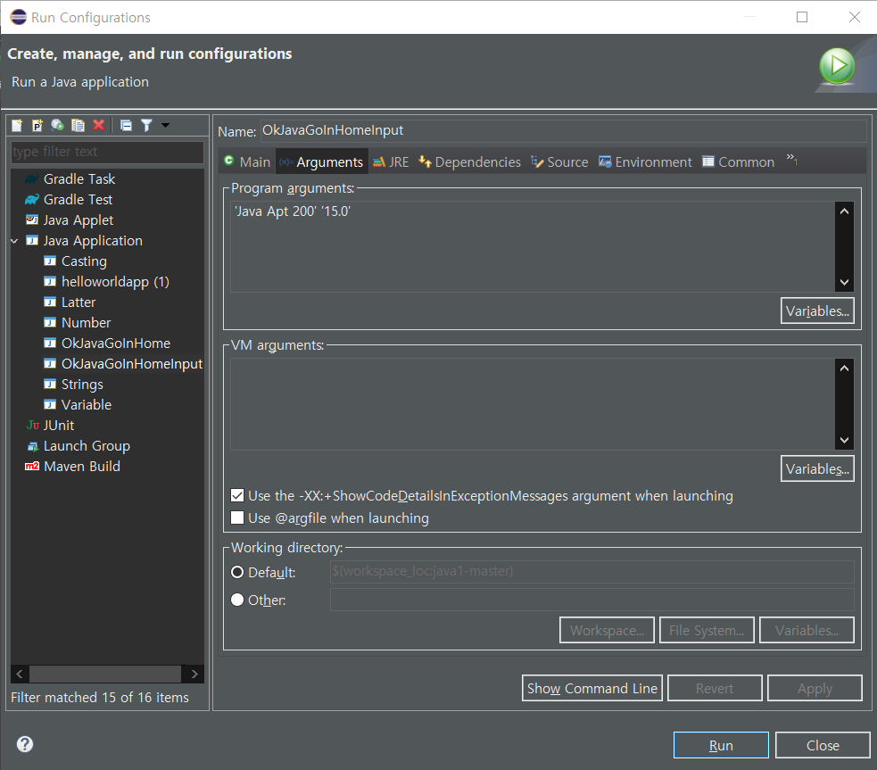

# [생활코딩] JAVA1 - 11.2. 입력과 출력



- 여기서 사용자가 입력한 값이 

```
public static void main(String[] args) {
```

- 우리가 선언한 여기서 배열로 args라는 값으로 들어간다.

```
String id = args[0];
String bright = args[1];
```

- 이렇게 값을 넣어주면 우리가 입력했던 값이 들어간다.