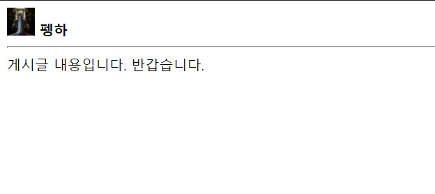

# [동빈나] 4강 - React의 Component와 Props

- 저번강의 이름, 학생, 색상이 속성

```html
<div id='root'></div>
```

```javascript
function Show(props) {
  return (
    <h3>
      Name is {props.name}
    </h3>  
  );
}

const element = <Show name='펭수'/>;
ReactDOM.render(element, document.getElementById('root'));
```

- Show라는 특정한 컴포넌트를 태그처럼 쓸 수  있다.

```javascript
ReactDOM.render(<Show name='펭수'/>, document.getElementById('root'));
```

- 이렇게 바로 넣어도 된다.

```javascript
function Show(props) {
  return (
    <h3>
      Name is {props.name}
    </h3>  
  );
}

Show.defaultProps = {
  name:'펭하'
}

ReactDOM.render(<Show/>, document.getElementById('root'));
```

- 디폴트 설정도 가능하다. 컴포넌트에 아무 값도 넣지 않으면 기본 값이 적용된다.

```javascript
function Show(props) {
  return (
    <h3>
      Name is {props.name}
    </h3>  
  );
}

function App() {
  return (
    <main>
      <Show name='펭수'/>
      <Show name='물범'/>
      <Show name='범이'/>
    </main>  
  )
}

Show.defaultProps = {
  name:'펭하'
}

ReactDOM.render(<App/>, document.getElementById('root'));
```

- App에서는 자식으로 Show라는 컴포넌트를 사용하고 있다.

- jsx는 감싸주는 태그(main과 같은)가 있어야 오류가 발생하지 않는다.

```javascript
function User(props) {
  return (
    <div>
      
      &nbsp;
      <strong>{props.user.name}</strong>
      </div>
  );
}

function Board(props) {
  return (
    <section>
      <User user={props.user}/>
      {props.title}
      <hr/>
      {props.content}
      </section>
  );
}

const board = {
  title:'게시글 제목입니다.',
  content:'게시글 내용입니다. 반갑습니다.',
  user : {
    name:'펭하',      imageUrl:'https://placeimg.com/32/32/any'
  }
}

ReactDOM.render(
  <Board 
    title = {board.titie}
    content = {board.content}
    user = {board.user}
    />,
  document.getElementById('root')
)
```

- User와 Board 컴포넌트를 생성한다.
- 그 다음에 board를 만들어서 이 값을 참조한다.
- 그럼 밑에서 Board의 user는 또 자식인 User를 타고 들어가 해당 컴포넌트값을 수행하게 된다.

