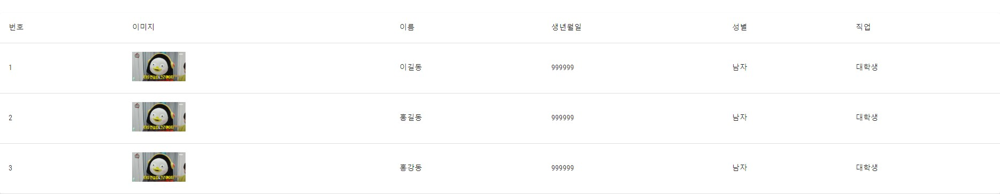

# 5강 - 고객 컴포넌트 구조화하기 

- map함수를 이용하면 for문처럼 여러개의 데이터를 출력할 수 있다.


# 6강 - Material UI를 적용하여 고객 테이블 디자인하기

```react
import Paper from '@material-ui/core/Paper';
import Table from '@material-ui/core/Table';
import TableHead from '@material-ui/core/TableHead';
import TableBody from '@material-ui/core/TableBody';
import TableRow from '@material-ui/core/TableRow';
import TableCell from '@material-ui/core/TableCell';
import {withStyles} from '@material-ui/core/styles';
```

- material-ui를 사용하여 부트스트랩처럼 구조를 잡았다. 

```react
const styles = theme => ({
  root:{
    width:'100%',
    marginTop:theme.spacing.unit * 3,
    overflowX:'auto'
  },
  table:{
    minWidth:1080
  }
})
```

```react
class App extends React.Component{
  render() {
    const {classes} = this.props;
    return (  
        <Paper className={classes.root}>
              <Table className={classes.table}>
                <TableHead>
                  <TableRow>
                    <TableCell>번호</TableCell>
                    <TableCell>이미지</TableCell>
                    <TableCell>이름</TableCell>
                    <TableCell>생년월일</TableCell>
                    <TableCell>성별</TableCell>
                    <TableCell>직업</TableCell>
                  </TableRow>
                </TableHead>
                <TableBody>
                {customers.map(c=>{ return( <Customer key={c.id}  id={c.id}  image={c.image}  name={c.name}  birthday={c.birthday}  gender={c.gender}  job={c.job} />)})}
                </TableBody>
              </Table>
          </Paper>
    );
  }
```

- props같은 경우는 상위 컴포넌트에서 하위 컴포넌트로 데이터를 넘겨줄 때 사용한다.



