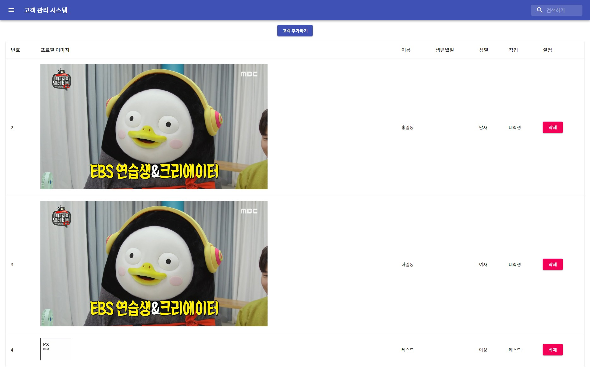

# [동빈나] 18강 - 필터(Filter) 함수를 이용한 고객(Customer) 검색 기능 구현하기

```react
handleValueChange = (e) => {
    let nextState = {};
    nextState[e.target.name] = e.target.value;
    this.setState(nextState);
  }
```

- App.js에 다음과 같은 함수를 추가함

```react
<InputBase
              placeholder="검색하기"
              classes={{
                root: classes.inputRoot,
                input: classes.inputInput,
              }}
              name="searchKeyword"
              value={this.state.searchKeyword}
              onChange={this.handleValueChange}
            />
```

- return에 있는 InputBase에는 다음과 같은 구문을 추가함

```react
const filteredComponents = (data) => {
      data = data.filter((c) => {
        return c.name.indexOf(this.state.searchKeyword) > -1;
      });
      return data.map((c) => {
        return <Customer stateRefresh={this.stateRefresh} key={c.id} id={c.id} image={c.image} name={c.name} birthday={c.birthday} gender={c.gender} job={c.job} /> 
      });
    }

----------------------
<TableBody>
              {this.state.customers ? 
                filteredComponents(this.state.customers) :
              <TableRow>
                <TableCell colSpan="6" align="center">
                  <CircularProgress className={classes.progress} variant="determinate" value={this.state.completed}/>
                </TableCell>
              </TableRow>
              }
            </TableBody>
```

- 사용자가 검색한 데이터를 검색하고 그 데이터가 있으면 그 데이터만 보이도록 수정
- 최종본은 아래와 같다.



